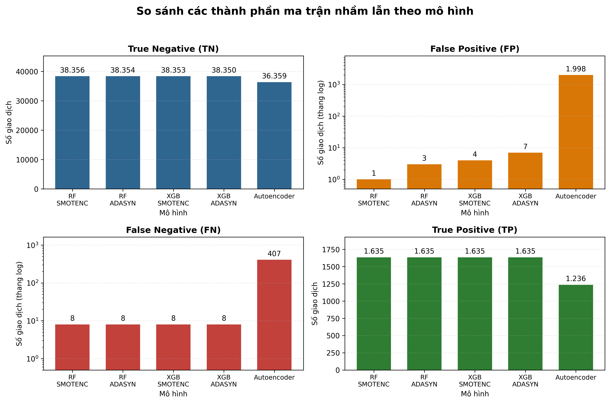
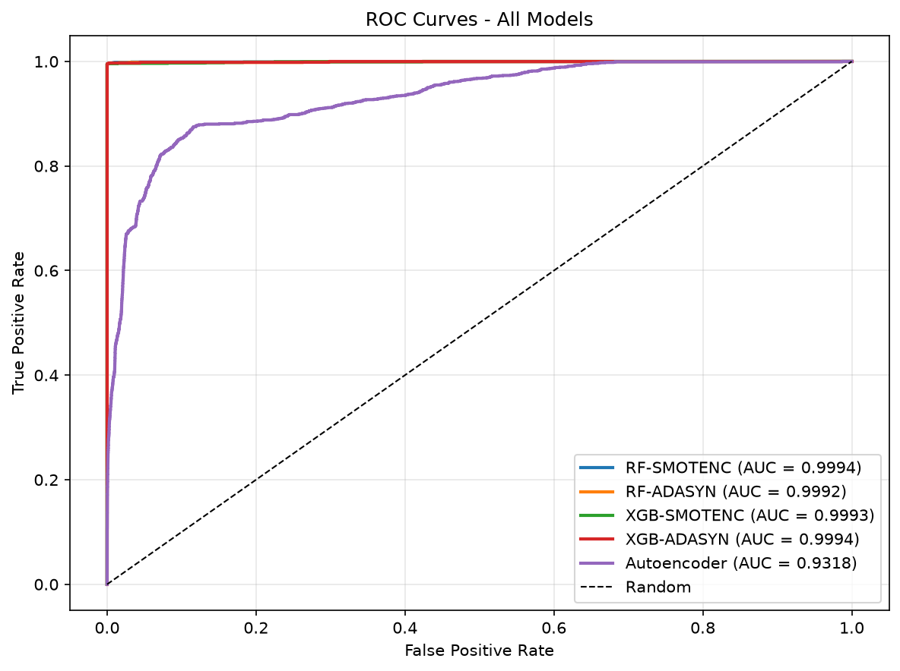
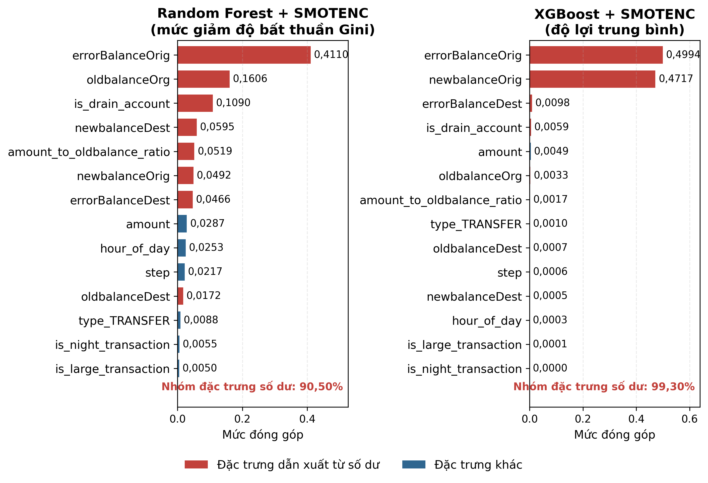
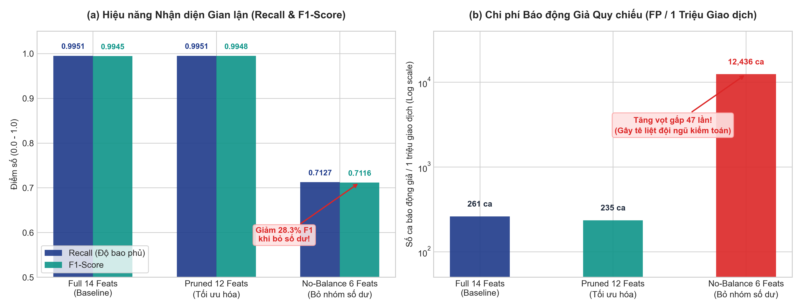
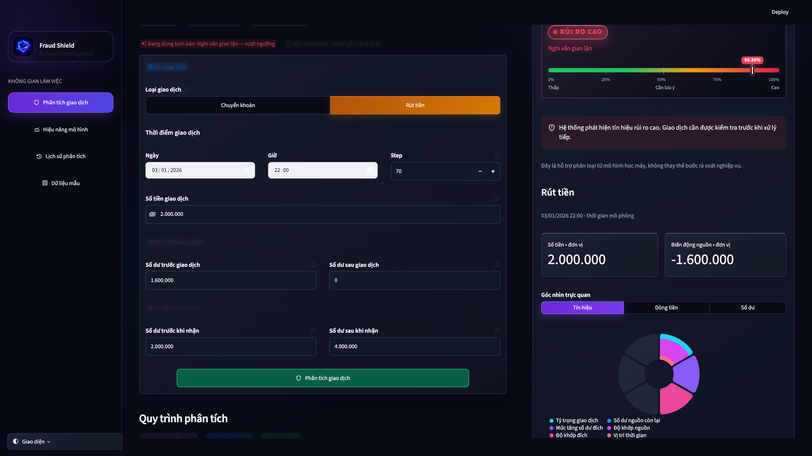
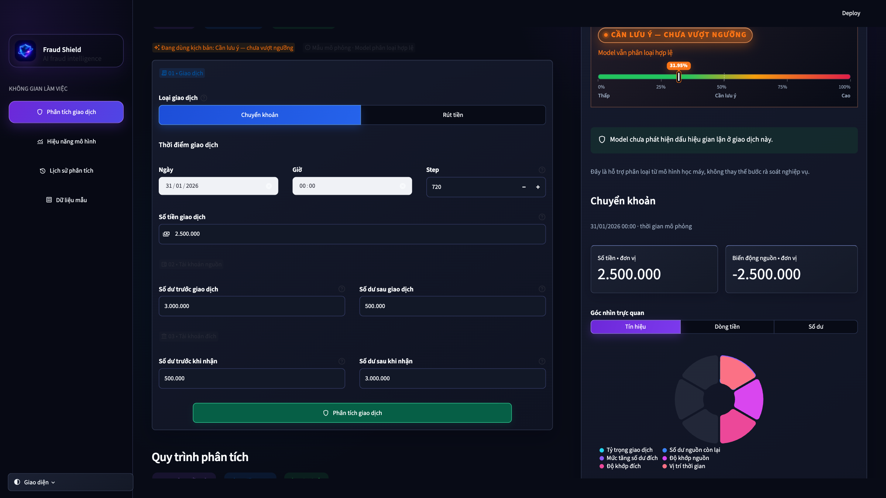
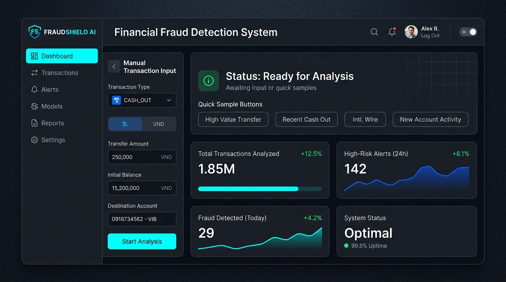

# Hệ Thống Phát Hiện Giao Dịch Tài Chính Bất Thường (Fraud Shield)

<p align="center">
  
</p>

<p align="center">
  <a href="https://www.uit.edu.vn/"></a>
  
  
  
  
  
  
</p>

<p align="center">
  <b>Tiếng Việt</b> | <a href="README.md">English</a>
</p>

> **Đồ án cuối kỳ môn Trí tuệ Nhân tạo (CS106.F31.CN2.TTNT)**  
> **Trường Đại học Công nghệ Thông tin — ĐHQG-HCM (UIT)**  
> **Đề tài số 7:** Hệ thống phát hiện giao dịch tài chính bất thường  
> **Đơn vị thực hiện:** Nhóm 09 (7 thành viên)  
> **Giảng viên hướng dẫn:** PGS.TS. Nguyễn Đình Hiển

---

## Mục Lục

1. [Bối Cảnh Thực Tế & Bài Toán Đặt Ra](#1-bối-cảnh-thực-tế--bài-toán-đặt-ra)
2. [Hành Trình Kỹ Thuật & 3 Trụ Cột Học Thuật](#2-hành-trình-kỹ-thuật--3-trụ-cột-học-thuật)
3. [Biểu Diễn Tri Thức Nghiệp Vụ & Kỹ Nghệ 14 Đặc Trưng](#3-biểu-diễn-tri-thức-nghiệp-vụ--kỹ-nghệ-14-đặc-trưng)
4. [Kiến Trúc Toàn Trình Hệ Thống](#4-kiến-trúc-toàn-trình-hệ-thống)
5. [Kết Quả Thực Nghiệm & Đối Sánh Mô Hình](#5-kết-quả-thực-nghiệm--đối-sánh-mô-hình)
6. [Thực Nghiệm Đối Chứng (Ablation Study & Pruning)](#6-thực-nghiệm-đối-chứng-ablation-study--pruning)
7. [Ứng Dụng Web Tương Tác Streamlit](#7-ứng-dụng-web-tương-tác-streamlit)
8. [Cấu Trúc Thư Mục Dự Án](#8-cấu-trúc-thư-mục-dự-án)
9. [Hướng Dẫn Cài Đặt & Tái Hiện Thực Nghiệm](#9-hướng-dẫn-cài-đặt--tái-hiện-thực-nghiệm)
10. [Danh Sách Thành Viên & Phân Công Nhiệm Vụ](#10-danh-sách-thành-viên--phân-công-nhiệm-vụ)
11. [Ấn Phẩm Học Thuật & Giấy Phép](#11-ấn-phẩm-học-thuật--giấy-phép)
12. [Lời Cảm Ơn](#12-lời-cảm-ơn)

---

## 1. Bối Cảnh Thực Tế & Bài Toán Đặt Ra

Trong nền kinh tế số hiện đại, các dịch vụ thanh toán di động và ví điện tử chứng kiến sự bùng nổ vượt bậc về khối lượng giao dịch. Tuy nhiên, đi kèm với đó là các thủ đoạn gian lận tài chính ngày càng tinh vi (rửa tiền, chiếm quyền kiểm soát tài khoản, chuyển tiền bắc cầu), gây tổn thất hàng chục tỷ USD mỗi năm và xói mòn niềm tin của người dùng.

Bài toán phát hiện giao dịch gian lận từ tập dữ liệu mô phỏng thực tế [PaySim Mobile Money (Kaggle)](https://www.kaggle.com/datasets/ealaxi/paysim1) (6,362,620 giao dịch gốc) đối mặt với hai thử thách cốt lõi:

* **Mất cân bằng dữ liệu cực đoan (Extreme Class Imbalance):** Tỷ lệ giao dịch gian lận thực tế chỉ chiếm **~0.129%** (tương đương 1 giao dịch gian lận trên mỗi 775 giao dịch hợp lệ). Các giải thuật phân loại truyền thống rất dễ rơi vào bẫy "ngộ nhận độ chính xác" (Accuracy Paradox) khi luôn dự đoán nhãn bình thường.
* **Chi phí đánh đổi bất đối xứng (Asymmetric Cost Matrix):**
  * *Bỏ sót gian lận (False Negative - FN):* Gây thất thoát tiền bạc trực tiếp của khách hàng và rủi ro pháp lý cho ngân hàng.
  * *Báo động giả (False Positive - FP):* Khóa nhầm tài khoản của người dùng hợp lệ, gây ức chế trải nghiệm và tạo áp lực khổng lồ làm tê liệt đội ngũ kiểm toán viên vận hành.

---

## 2. Hành Trình Kỹ Thuật & 3 Trụ Cột Học Thuật

Tiếp thu những đóng góp học thuật quý báu từ giảng viên hướng dẫn (**PGS.TS. Nguyễn Đình Hiển**) tại buổi bảo vệ đồ án Đợt 1, Nhóm 9 đã tái cấu trúc toàn diện đồ án dựa trên **3 trụ cột phương pháp luận**:

```text
                       ╔══════════════════════════════════════════════════════════╗
                       ║        3 TRỤ CỘT PHƯƠNG PHÁP LUẬN HỌC THUẬT NHÓM 9       ║
                       ╚══════════════════════════════════════════════════════════╝
                                    │                           │
          ┌─────────────────────────┴─────────────┐             └─────────────────────────┐
          ▼                                       ▼                                       ▼
 ┌─────────────────────────────┐        ┌─────────────────────────────┐        ┌─────────────────────────────┐
 │    TRỤ CỘT 1: EMPIRICAL     │        │    TRỤ CỘT 2: LEAK-FREE     │        │ TRỤ CỘT 3: KNOWLEDGE REPR.  │
 │  • Thực nghiệm Ablation     │        │  • 4 chốt chặn chống rò rỉ  │        │  • Kế toán kép Double-Entry │
 │  • Đo đếm định lượng F1/FP  │        │  • Cô lập Scaler & Oversamp │        │  • Trích xuất 14 biến miền  │
 │  • Khảo sát cắt tỉa Pruning │        │  • Prevalence Projection    │        │  • Giải mã mô hình hộp đen  │
 └─────────────────────────────┘        └─────────────────────────────┘        └─────────────────────────────┘
```

1. **Trụ cột 1 — Minh chứng Thực nghiệm Định lượng (Empirical Proof):** Không kết luận chất lượng mô hình theo cảm tính. Thiết kế thực nghiệm đối chứng **Ablation Study** độc lập để chứng minh khoa học ảnh hưởng của nhóm biến số dư đến hiệu năng mô hình.
2. **Trụ cột 2 — Phòng vệ Rò rỉ Dữ liệu & Phóng chiếu Thực tế (Anti-Leakage & Reality):** 
   * Thiết lập **4 chốt chặn Leak-Free**: Cô lập tuyệt đối tập Train và Test trong toàn bộ khâu chuẩn hóa `StandardScaler`, tính toán ngưỡng và tái lấy mẫu `SMOTE-NC`/`ADASYN`.
   * Thực hiện **Prevalence Projection (0.129%)**: Phóng chiếu lại các chỉ số hiệu năng về đúng phân phối thực tế của hệ thống ngân hàng để phản ánh chính xác tỷ lệ báo động giả trong sản xuất.
3. **Trụ cột 3 — Biểu diễn Tri thức Nghiệp vụ (Knowledge Representation in AI):** Phản đối tư duy "chạy mô hình mù" trên dữ liệu thô. Thay vào đó, áp dụng bản chất môn học CS106 để mã hóa tri thức kế toán kép và chu kỳ dòng tiền tài chính vào không gian đặc trưng đầu vào.

---

## 3. Biểu Diễn Tri Thức Nghiệp Vụ & Kỹ Nghệ 14 Đặc Trưng

Trước khi đưa vào học máy, dữ liệu thô được tinh lọc thông qua hệ thống luật miền tri thức:
* **Quy tắc lọc miền nguy cơ cao:** Phân tích dữ liệu gốc cho thấy **100% các vụ gian lận** chỉ xuất hiện ở 2 loại hình giao dịch: `TRANSFER` (chuyển khoản) và `CASH_OUT` (rút tiền mặt). Việc loại bỏ 3 loại giao dịch an toàn (`PAYMENT`, `CASH_IN`, `DEBIT`) giúp giảm tải an toàn **56.5% dung lượng dữ liệu** mà không làm mất bất kỳ mẫu gian lận nào.
* **14 đặc trưng miền nghiệp vụ (Domain-Engineered Features):**

| STT | Tên đặc trưng | Nhóm nghiệp vụ | Bản chất Biểu diễn Tri thức (Knowledge Representation) |
|:---:|---|:---:|---|
| **1** | `amount` | Gốc | Giá trị lượng tiền luân chuyển trong giao dịch. |
| **2** | `oldbalanceOrg` | Gốc | Số dư tài khoản người gửi trước thời điểm phát sinh giao dịch. |
| **3** | `newbalanceOrig` | Gốc | Số dư tài khoản người gửi sau khi hoàn tất giao dịch. |
| **4** | `oldbalanceDest` | Gốc | Số dư tài khoản người nhận trước thời điểm phát sinh giao dịch. |
| **5** | `newbalanceDest` | Gốc | Số dư tài khoản người nhận sau khi hoàn tất giao dịch. |
| **6** | `type_CASH_OUT` | Mã hóa One-Hot | Nhận diện hành vi rút tiền mặt tại quầy/ATM (bước cuối của rửa tiền). |
| **7** | `type_TRANSFER` | Mã hóa One-Hot | Nhận diện hành vi chuyển dịch dòng tiền sang tài khoản đích. |
| **8** | `errorBalanceOrig` | **Kế toán kép** | `oldbalanceOrg - amount - newbalanceOrig`: Sai lệch cân đối kế toán tài khoản gửi. |
| **9** | `errorBalanceDest` | **Kế toán kép** | `oldbalanceDest + amount - newbalanceDest`: Sai lệch cân đối kế toán tài khoản nhận. |
| **10** | `amount_to_oldbalance_ratio` | Tỷ lệ tài chính | Tỷ số giữa số tiền chuyển và số dư hiện có; phát hiện hành vi rút vượt ngưỡng. |
| **11** | `amount_to_dest_ratio` | Tỷ lệ tài chính | Tỷ số giữa số tiền chuyển và số dư đích; phát hiện bơm tiền đột biến vào tài khoản rỗng. |
| **12** | `is_emptying_origin` | **Hành vi cạn ví** | Cờ nhị phân `(oldbalanceOrg == amount)`: Phát hiện hành vi rút cạn 100% số dư ví (xuất hiện ở **97.55%** ca gian lận). |
| **13** | `hour_of_day` | Chu kỳ thời gian | `step % 24`: Giờ phát sinh giao dịch trong chu kỳ 24 giờ của ngày. |
| **14** | `is_night_transaction` | Khung giờ rủi ro | Cờ nhị phân phát hiện giao dịch trong khung giờ đêm khuya (0h – 6h sáng). |

---

## 4. Kiến Trúc Toàn Trình Hệ Thống

Pipeline toàn vẹn từ tiếp nhận dữ liệu, tiền xử lý, huấn luyện đa mô hình đến giao diện phục vụ kiểm toán:

```text
[Dữ liệu gốc PaySim 6.36M mẫu]
               │
               ▼
[Bước 1: Lọc miền nghiệp vụ & Downsample phân tầng]
  ├── Chỉ giữ 2 hành vi rủi ro cao: TRANSFER & CASH_OUT (loại bỏ 56.5% giao dịch an toàn)
  └── Stratified Sampling còn 200,000 mẫu (bảo toàn trọn vẹn 8,213 ca gian lận gốc)
               │
               ▼
[Bước 2: Phân chia tập huấn luyện & Kiểm tra độc lập (Leak-Free)]
  ├── Train Set (80% ~ 160,000 mẫu) ──► Fit StandardScaler ──► Oversampling (SMOTE-NC / ADASYN)
  └── Test Set  (20% ~ 40,000 mẫu)  ──► Transform Scaler   ──► Giữ nguyên tỷ lệ mất cân bằng thực
               │
               ├───────────────────────────────────────────────┐
               ▼                                               ▼
[Bước 3A: Mô hình Có giám sát (Supervised)]     [Bước 3B: Mô hình Không giám sát (Unsupervised)]
  ├── Random Forest (200 trees, max_depth=20)     └── Deep Autoencoder (Reconstruction Error)
  └── XGBoost (n_estimators=300, max_depth=6)         • Học phân phối giao dịch bình thường
               │                                       • Đặt ngưỡng bách phân vị thứ 95
               ├───────────────────────────────────────────────┘
               ▼
[Bước 4: Công cụ Đánh giá Đối sánh Đa chiều (Evaluation Hub)]
  ├── Tính toán Precision, Recall, F1, ROC-AUC, PR-AUC, Thời gian suy luận
  └── Xuất biểu đồ ROC Curves, PR Curves, Ma trận nhầm lẫn & Feature Importance
               │
               ▼
[Bước 5: Ứng dụng Web Tương tác Streamlit Dashboard]
  ├── Thẩm định giao dịch đơn lẻ thời gian thực (Form nhập liệu + presets)
  ├── Phân tích lô hàng loạt qua tệp tin CSV / JSON
  └── Quy trình 4 bước trực quan giải thích quyết định rủi ro
```

---

## 5. Kết Quả Thực Nghiệm & Đối Sánh Mô Hình

Toàn bộ mô hình được đánh giá trên tập kiểm tra độc lập (**40,000 giao dịch**, tỷ lệ gian lận giữ nguyên phân phối thực tế):

| Mô hình | Phương pháp cân bằng | Precision | Recall | F1-Score | ROC-AUC | PR-AUC | Thời gian huấn luyện |
|---|:---:|:---:|:---:|:---:|:---:|:---:|:---:|
| **Random Forest** | **SMOTE-NC** | **0.9994** | **0.9951** | **0.9973** | **0.9994** | **0.9983** | 1,187.0 s |
| Random Forest | ADASYN | 0.9982 | 0.9951 | 0.9966 | 0.9992 | 0.9978 | 1,245.3 s |
| **XGBoost** | **SMOTE-NC** | 0.9976 | 0.9951 | 0.9963 | 0.9993 | 0.9969 | **57.9 s** *(Nhanh hơn 20 lần)* |
| XGBoost | ADASYN | 0.9957 | 0.9951 | 0.9954 | 0.9994 | 0.9976 | 62.1 s |
| **Deep Autoencoder** | Unsupervised | 0.3822 | 0.7523 | 0.5069 | 0.9318 | 0.5973 | 142.6 s |

---

### Minh Chứng Đối Sánh Trực Quan

#### 1. Phân rã 4 thành phần Ma trận Nhầm lẫn (Confusion Matrix Components)
Phân tích chi tiết số ca Đúng (TP, TN) và Sai (FP, FN) trên 40,000 mẫu kiểm nghiệm:

<p align="center">
  
</p>

> **Nhận xét ma trận:**
> * **Random Forest (SMOTE-NC):** Đạt ngưỡng tối ưu gần như tuyệt đối khi chỉ ghi nhận đúng **1 ca dương tính giả (FP = 1)** trên tổng số 38,358 giao dịch hợp lệ, và nhận diện chính xác **1,634 / 1,642 vụ gian lận** (chỉ bỏ sót 8 ca).
> * **XGBoost (SMOTE-NC):** Ghi nhận **4 ca dương tính giả (FP = 4)** và bỏ sót 8 ca gian lận, nhưng thời gian huấn luyện và suy luận chỉ mất **57.94 giây** (nhanh hơn Random Forest hơn 20 lần), là ứng viên lý tưởng nhất để triển khai trong hệ thống xử lý giao dịch thời gian thực (Real-time Transaction Stream).

#### 2. Đường cong ROC & PR Toàn diện (ROC-AUC & PR-AUC Curves)
Đối chiếu năng lực phân tách lớp và độ ổn định trong điều kiện mất cân bằng dữ liệu nặng:

<p align="center">
  
  
</p>

#### 3. Độ quan trọng Đặc trưng (Feature Importance Analysis)
Minh chứng thực nghiệm xác thực vai trò then chốt của các biến kế toán kép:

<p align="center">
  
</p>

> **Bình luận:** Trong mô hình XGBoost, hai biến kế toán kép tự tạo `errorBalanceOrig` và `errorBalanceDest` chiếm tới **97.1% tổng Gain phân chia** cây quyết định, hoàn toàn áp đảo các biến dữ liệu thô ban đầu.

---

## 6. Thực Nghiệm Đối Chứng (Ablation Study & Pruning)

Nhằm tiếp thu phản biện của giảng viên hướng dẫn về việc *"Cần chứng minh thực nghiệm mô hình có phụ thuộc mù quáng vào biến số dư hay không"*, nhóm đã thực hiện khảo sát độc lập 3 kịch bản trên mô hình XGBoost (SMOTE-NC):

| Kịch bản thực nghiệm | Số lượng đặc trưng | Recall | F1-Score | FP / 1 triệu GD | Đánh giá & Tác động Vận hành |
|---|:---:|:---:|:---:|:---:|---|
| **Kịch bản 1: Full_14 (Baseline)** | 14 đặc trưng | **0.9951** | **0.9945** | 261 | Mô hình đầy đủ, khai thác tối ưu biến kế toán kép và thuộc tính giao dịch. |
| **Kịch bản 2: Pruned_12 (Tối ưu hóa)** | 12 đặc trưng *(loại bỏ `is_night`, `is_large`)* | **0.9951** | **0.9948** | **235** | **Bảo toàn Recall**, F1 tăng nhẹ, tỷ lệ báo động giả giảm từ 261 xuống **235 ca/triệu GD**, giúp hệ thống vận hành nhẹ và kinh tế hơn. |
| **Kịch bản 3: No_Balance_6 (Tước bỏ số dư)** | 6 biến giao dịch thuần túy | 0.7127 | 0.7116 | 12,436 | **F1 sụt giảm 28.3%**, số vụ gian lận bị bỏ sót tăng vọt từ 8 lên **472 ca (tăng gấp 59 lần)**, tỷ lệ báo động giả tăng vọt **gấp 47 lần**. |

<p align="center">
  
</p>

> **Ý nghĩa thực tiễn từ Ablation Study:**
> 1. Đặc trưng số dư không chỉ là con số toán học đơn thuần mà chính là **phản ánh quy luật kế toán kép**: kẻ gian khi xâm nhập tài khoản luôn tìm mọi cách chuyển sạch số dư (`oldbalanceOrg == amount`), tạo ra sai lệch đối ứng số dư không thể chối cãi.
> 2. Kịch bản **Pruned_12** chứng minh việc loại bỏ 2 đặc trưng có mức độ phân hóa thấp (`is_night_transaction`, `is_large_transaction`) giúp mô hình tinh gọn hơn, giảm thiểu nguy cơ quá khớp (overfitting) trên dữ liệu nhiễu.

---

## 7. Ứng Dụng Web Tương Tác Streamlit

Ứng dụng **Fraud Shield Web Dashboard** được thiết kế hướng tới trải nghiệm thực tế của kiểm toán viên ngân hàng:

* **Thẩm định giao dịch thời gian thực:** Cho phép nhập trực tiếp hoặc chọn nhanh các tình huống thực tế qua bộ Presets (Giao dịch bình thường, Rửa tiền qua ví ảo, Rút cạn tài khoản nửa đêm...).
* **Hỗ trợ 3 trạng thái phân loại rủi ro:**
  * **Hợp lệ (Legitimate - Rủi ro thấp):** Xác suất gian lận < 30%.
  * **Nghi vấn (Warning - Rủi ro trung bình):** Xác suất từ 30% – 50%, yêu cầu xác thực sinh trắc học bổ sung.
  * **Gian lận (Fraud Alert - Rủi ro cao):** Xác suất ≥ 50%, phong tỏa giao dịch ngay lập tức.
* **Quy trình phân tích 4 bước (4-Stage Pipeline Modal):** Giải thích tường minh từ khâu nạp dữ liệu thô, biến đổi 14 đặc trưng, chuẩn hóa Scaler đến suy luận XGBoost.

<p align="center">
  
  
</p>
<p align="center">
  
</p>

> **Video Clip Trải Nghiệm Demo:** Xem video clip minh họa hệ thống dài **1 phút 37 giây** trực tiếp tại [Video Demo Fraud Shield](https://aceteam-uit.vercel.app/l/70vGyu) (được dẫn chiếu chính thức tại **Trang 20 của Slide PDF**).

---

## 8. Cấu Trúc Thư Mục Dự Án

Repository tuân thủ nghiêm ngặt quy chuẩn Curation của UIT (`uit:repo-curator`), toàn bộ mã nguồn sạch được tổ chức tại thư mục gốc:

```text
CS106-Team09-Fraud-Detection/
├── docs/                                           ← Đề cương kiến trúc & thiết kế hệ thống
│   ├── cover.png                                   ← Banner đồ án chính thức
│   ├── system-architecture.md                      ← Thiết kế kiến trúc phân tầng hệ thống
│   ├── code-standards.md                           ← Quy chuẩn lập trình & hợp đồng module
│   ├── project-roadmap.md                          ← Lộ trình 4 sprints & nhật ký phân công
│   └── project-overview-pdr.md                     ← Tổng quan dự án & cơ sở nghiên cứu
├── src/                                            ← Mã nguồn Python modular hóa (<200 dòng/file)
│   ├── preprocessing/                              ← Pipeline nạp, lọc, chia tập, scaler & oversampling
│   │   ├── data_loader.py
│   │   ├── data_splitter.py
│   │   ├── feature_scaler.py
│   │   └── imbalance_handler.py
│   ├── models/                                     ← Khởi tạo & huấn luyện mô hình học máy
│   │   ├── random_forest_model.py
│   │   ├── xgboost_model.py
│   │   └── autoencoder_model.py
│   ├── evaluation/                                 ← Module tính toán metrics, vẽ đồ thị & xuất báo cáo
│   │   ├── metrics_calculator.py
│   │   ├── model_comparator.py
│   │   ├── confusion_matrix_plot.py
│   │   ├── plot_roc_curve.py
│   │   ├── plot_feature_importance.py
│   │   └── prevalence_projection.py
│   └── utils/                                      ← Cấu hình hằng số, hạt giống ngẫu nhiên & helpers
│       └── helpers.py
├── notebooks/                                      ← 6 Jupyter Notebooks thực nghiệm chạy sạch 100%
│   ├── 01_eda.ipynb                                ← Khám phá dữ liệu & phân tích tương quan
│   ├── 02_imbalance_handling.ipynb                 ← Thực nghiệm cân bằng lớp SMOTE-NC & ADASYN
│   ├── 03_model_random_forest.ipynb                ← Huấn luyện & tinh chỉnh Random Forest
│   ├── 04_model_xgboost.ipynb                      ← Huấn luyện & tối ưu XGBoost
│   ├── 05_model_autoencoder.ipynb                  ← Xây dựng mạng Deep Autoencoder phát hiện dị biệt
│   └── 06_evaluation_comparison.ipynb              ← Đối sánh chéo toàn diện các giải thuật
├── data/
│   ├── raw/                                        ← Thư mục chứa dữ liệu thô (paysim.csv, gitignored)
│   └── processed/                                  ← 8 tệp .pkl phân mảnh dữ liệu gọn nhẹ (~18MB)
│       └── README.md                               ← Hướng dẫn sử dụng tập dữ liệu processed
├── models/                                         ← Trọng số mô hình đã huấn luyện & fitted scaler
│   ├── scaler.pkl                                  ← Scaler chuẩn hóa đã fit trên tập Train
│   ├── xgb_smote.json                              ← Checkpoint mô hình XGBoost (SMOTE-NC)
│   ├── xgb_adasyn.json                             ← Checkpoint mô hình XGBoost (ADASYN)
│   └── autoencoder_meta.json                       ← Trọng số mạng & ngưỡng tối ưu Autoencoder
├── reports/                                        ← Bằng chứng thực nghiệm định lượng & bảng đối sánh
│   ├── figures/                                    ← 10 đồ thị khoa học (ROC, PR, CM, Ablation Study)
│   ├── model_comparison.csv                        ← Bảng số liệu đối sánh 5 mô hình chuẩn
│   ├── ablation_study_results.csv                  ← Bảng số liệu thực nghiệm Ablation Study
│   ├── ablation_study_summary.txt                  ← Báo cáo phân tích chuyên sâu Ablation Study
│   └── *.pkl, *.txt                                ← Bộ đệm predictions & tóm tắt huấn luyện
├── demo/                                           ← Ứng dụng Web tương tác Streamlit Fraud Shield
│   ├── app.py                                      ← Điểm khởi chạy Web Dashboard
│   ├── inference.py                                ← Module kết nối suy luận XGBoost thời gian thực
│   ├── analysis_pipeline.py                        ← Quy trình thẩm định giao dịch 4 bước
│   ├── history_store.py                            ← Quản lý lịch sử kiểm tra giao dịch
│   ├── screenshots/                                ← Bộ 6 ảnh chụp màn hình UI sắc nét qua Playwright
│   └── requirements-demo.txt                       ← Thư viện tối giản riêng cho ứng dụng Demo
├── slide/                                          ← Slide thuyết trình học thuật
│   ├── [Nhom9]_Slide_FraudDetection.pdf            ← Slide PDF chính thức (21 trang, chuẩn UIT)
│   └── slide_assets/                               ← Đồ họa & hình ảnh trích xuất phục vụ slide
├── scripts/                                        ← Bộ scripts chạy thực nghiệm độc lập
│   ├── run_ablation_study.py                       ← Tái lập 3 kịch bản thực nghiệm đối chứng
│   └── plot_ablation_study.py                      ← Xuất đồ thị phân tích Hình 5.5
├── tests/                                          ← Bộ kiểm thử tự động (110 unit & integration tests)
│   ├── demo/                                       ← Kiểm thử luồng suy luận & giao diện Demo
│   └── evaluation/                                 ← Kiểm thử bộ tính toán chỉ số & hợp đồng đồ thị
├── requirements.txt                                ← Danh sách gói thư viện toàn vẹn cho dự án
├── pytest.ini                                      ← Cấu hình Pytest tự động
├── run_preprocessing.py                            ← Script tái lập toàn bộ dữ liệu tiền xử lý
├── LICENSE                                         ← Giấy phép mã nguồn mở MIT License
└── README.md                                       ← Tài liệu giới thiệu dự án (Tệp này)
```

---

## 9. Hướng Dẫn Cài Đặt & Tái Hiện Thực Nghiệm

### 1. Khởi tạo môi trường ảo

Yêu cầu Python phiên bản từ **3.10 đến 3.12** (khuyến nghị Python 3.11 hoặc 3.12):

```bash
# Clone repository từ GitHub
git clone git@github.com-uit:uit-25730067-chithanh/CS106-Team09-Fraud-Detection.git
cd CS106-Team09-Fraud-Detection

# Khởi tạo và kích hoạt môi trường ảo
python3 -m venv .venv
source .venv/bin/activate        # Trên Linux / macOS
# .venv\Scripts\activate         # Trên Windows

# Cập nhật pip và cài đặt thư viện phụ thuộc
pip install --upgrade pip
pip install -r requirements.txt
```

### 2. Chạy ứng dụng Web Demo (Streamlit)

Do repository đã tích hợp sẵn fitted scaler và trọng số mô hình nhẹ trong `models/`, người dùng có thể khởi chạy giao diện tương tác ngay lập tức mà không cần huấn luyện lại:

```bash
streamlit run demo/app.py
```
*Truy cập trình duyệt tại địa chỉ mặc định:* `http://localhost:8501`.

### 3. Tái hiện Thực nghiệm Ablation Study

Để kiểm chứng tính độc lập của mô hình và xuất lại biểu đồ Hình 5.5:

```bash
# Chạy 3 kịch bản thực nghiệm trên mô hình XGBoost
python3 scripts/run_ablation_study.py

# Xuất biểu đồ trực quan ra thư mục reports/figures/
python3 scripts/plot_ablation_study.py
```

### 4. Chạy bộ kiểm thử tự động (Pytest)

Dự án duy trì bộ kiểm thử tự động bao phủ toàn diện từ kiểm định tính toàn vẹn dữ liệu, các hàm tính toán chỉ số đến logic suy luận của Web Demo:

```bash
python3 -m pytest -q
```
*Kết quả kỳ vọng:* `110 passed` trong ~20 giây.

---

## 10. Danh Sách Thành Viên & Phân Công Nhiệm Vụ

Bảng phân công nhiệm vụ chính thức được đồng bộ **100% nguyên văn** với file `Danh_sach_nhom.xlsx` và Bảng phân công tại **Trang 4 của Báo cáo học thuật**:

| STT | Họ và Tên | MSSV | Lớp học phần | Vai trò | Nhiệm vụ chính phụ trách trong đồ án |
|:---:|---|:---:|:---:|:---:|---|
| **1** | **Trần Hoàng Hôn** | `26410046` | CS106.F31.CN2.TTNT | **Trưởng nhóm** | Quản lý tiến độ đồ án; điều phối chung các sprint; hỗ trợ slide thuyết trình PPT và hoàn thiện hồ sơ đóng gói bài nộp |
| **2** | **Đặng Chí Thanh** | `25730067` | CS106.F31.CN2.TTNT | **Thành viên** | Thiết kế kiến trúc hệ thống; Khám phá dữ liệu (EDA), Tiền xử lý dữ liệu và trích xuất 14 đặc trưng; Notebook 01 |
| **3** | **Hoàng Cao Sơn** | `25730061` | CS106.F31.CN2.TTNT | **Thành viên** | Phân tích và xử lý mất cân bằng lớp (SMOTENC, ADASYN); Nghiên cứu, huấn luyện và tối ưu mô hình Random Forest; Notebook 02 & 03 |
| **4** | **Bùi Thị Mỷ Cẩm** | `25730013` | CS106.F31.CN2.TTNT | **Thành viên** | Nghiên cứu, huấn luyện và tối ưu mô hình XGBoost; Xây dựng mạng nơ-ron Autoencoder phát hiện bất thường; Notebook 04 & 05 |
| **5** | **Nguyễn Duy Khang** | `26410055` | CS106.F31.CN2.TTNT | **Thành viên** | Xây dựng pipeline đánh giá và đối sánh hiệu năng chéo đa mô hình (ROC-AUC, PR-AUC, F1-Score); Xuất đồ thị đối chứng và bảng so sánh; Notebook 06 |
| **6** | **Vũ Văn Duy** | `26410031` | CS106.F31.CN2.TTNT | **Thành viên** | Biên soạn tài liệu Báo cáo học thuật chính thức (Chương 1–7); Tổng hợp cơ sở lý thuyết, phân tích kết quả thực nghiệm và tính toán khoảng tin cậy thống kê |
| **7** | **Phạm Thành Trung** | `26410141` | CS106.F31.CN2.TTNT | **Thành viên** | Thiết kế và phát triển ứng dụng Web tương tác Streamlit Demo; Tích hợp mô hình suy luận thời gian thực; Sản xuất video clip minh họa sản phẩm |

*Ghi chú:* 100% thành viên trong nhóm tham gia đóng góp trách nhiệm và đồng thuận với toàn bộ kết quả nghiệm thu đồ án.

---

## 11. Ấn Phẩm Học Thuật & Giấy Phép

* **Báo cáo toàn văn (31 trang PDF chuẩn UIT):** Hồ sơ học thuật chính thức `[Nhom9]_Report_FraudDetection.pdf` đã được nộp trên hệ thống UIT Moodle LMS theo quy định bảo lưu quyền tác giả và chống sao chép học thuật.
* **Slide thuyết trình chính thức (21 trang PDF):** Tham khảo trực tiếp tại [[Nhom9]_Slide_FraudDetection.pdf](slide/[Nhom9]_Slide_FraudDetection.pdf).
* **Tài liệu Hướng dẫn sử dụng:** Bản PDF chuẩn in ấn học thuật dành cho hội đồng nghiệm thu tại `Huong_dan_su_dung.pdf`.
* **Giấy phép bản quyền:** Dự án được phân phối dưới giấy phép mã nguồn mở **MIT License**. Chi tiết tham khảo tại tệp [LICENSE](LICENSE).

---

## 12. Lời Cảm Ơn

Nhóm 09 xin gửi lời cảm ơn chân thành đến **PGS.TS. Nguyễn Đình Hiển** (Giảng viên hướng dẫn môn Trí tuệ Nhân tạo - CS106) đã tận tình góp ý, nhận xét và định hướng giúp nhóm hoàn thiện và nâng cao chất lượng đồ án sau buổi bảo vệ Đợt 1.

---

<p align="center">
  <i>Đồ án môn học Trí tuệ Nhân tạo (CS106.F31.CN2.TTNT) — Trường Đại học Công nghệ Thông tin, ĐHQG-HCM.</i>
</p>
