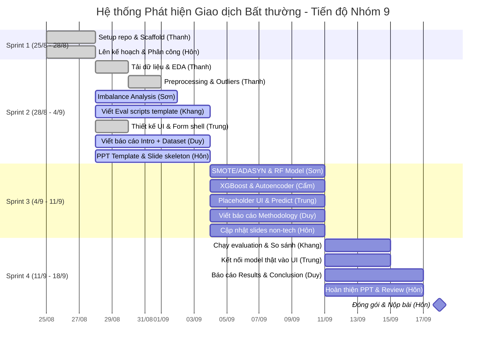

# Project Roadmap — Fraud Detection Nhóm 9

## Hành trình dự án

**Bắt đầu:** 25/08/2026 (Thứ 3) &nbsp;|&nbsp; **Báo cáo:** Buổi 10 (~19/09/2026) &nbsp;|&nbsp; **Sprint review:** Mỗi tối Thứ 6 hàng tuần

> Nhóm Preprocessing & Modeling (Thanh, Sơn, Cẩm) tập trung triển khai pipeline dữ liệu và huấn luyện. Nhóm Đánh giá & Báo cáo (Hôn, Khang, Duy, Trung) triển khai song song các phần việc bổ trợ để tối ưu thời gian.

---

## 🗺️ Lộ trình tổng thể (Biểu đồ Gantt)

---

## 🏃 Sprint 1 — 25/8 (Thứ 3) → 28/8 tối (Thứ 6)

> **Mục tiêu Sprint 1:** Khởi động dự án, thiết lập môi trường và cấu trúc thư mục, thống nhất phân công.
> **Sprint Review:** Tối Thứ 6 28/8 — tổng kết setup repo và kick-off Sprint 2.

### Thanh
| Task | Trạng thái |
|------|-----------|
| ✅ Setup repo, tạo cấu trúc thư mục | **Xong** |

### Hôn
| Task | Trạng thái |
|------|-----------|
| ✅ PM: Lên kế hoạch dự án, phân công vai trò & theo dõi tiến độ nhóm hàng tuần | **Xong** |

---

## 🏃 Sprint 2 — 28/8 (Thứ 6) → 4/9 tối (Thứ 6)

> **Mục tiêu Sprint 2:** Hoàn thành EDA, Preprocessing (Thanh) + Imbalance Analysis (Sơn). Lớp A viết xong các template scripts, UI shell và nháp báo cáo.
> **Sprint Review:** Tối Thứ 6 4/9 — báo cáo tiến độ EDA và check-point code/design của lớp A.

### Thanh
| Task | Ưu tiên | Trạng thái |
|------|---------|-----------|
| Setup môi trường (venv) & Tải dataset từ Kaggle   *[Đầu vào: Kaggle dataset link \| Đầu ra: `data/raw/paysim.csv`, `.venv`]* | 🔴 Critical | ✅ |
| Notebook EDA & Trực quan hóa (Phân phối Class, Amount, step, type, balances)   *[Đầu vào: `data/raw/paysim.csv` \| Đầu ra: `notebooks/01_eda.ipynb` với ít nhất 5 charts]* | 🔴 Critical | ✅ |
| Preprocessing dữ liệu (Chuẩn hóa các cột balances/amount & One-Hot Encoding `type` & Downsampling)   *[Đầu vào: `data/raw/paysim.csv` \| Đầu ra: scaled columns, OHE, downsampled splits, fitted `models/scaler.pkl`]* | 🔴 Critical | ✅ |
| Chia tập dữ liệu Train/Test split (Stratified 80/20)   *[Đầu vào: scaled data \| Đầu ra: `data/processed/X_train.pkl`, `X_test.pkl`, `y_train.pkl`, `y_test.pkl`]* | 🔴 Critical | ✅ |
### Sơn
| Task | Ưu tiên | Trạng thái |
|------|---------|-----------|
| Phân tích + visualize tỷ lệ mất cân bằng (sau khi Thanh tải xong)   *[Đầu vào: `data/raw/paysim.csv` \| Đầu ra: tỷ lệ phân phối Class trên biểu đồ]* | 🟡 High | 🔲 |

### Khang *(bắt đầu ngay, không cần chờ data)*
| Task | Ưu tiên | Trạng thái |
|------|---------|-----------|
| Viết `src/evaluation/metrics-calculator.py` template   *[Đầu vào: None \| Đầu ra: script định nghĩa hàm `compute_metrics`]* | 🟡 High | 🔲 |
| Viết `src/evaluation/plot-roc-curve.py` template   *[Đầu vào: None \| Đầu ra: script định nghĩa hàm `plot_roc_curves` & `plot_pr_curves`]* | 🟡 High | 🔲 |

### Trung *(bắt đầu ngay, không cần chờ data)*
| Task | Ưu tiên | Trạng thái |
|------|---------|-----------|
| Thiết kế wireframe UI (layout, input fields, output area)   *[Đầu vào: None \| Đầu ra: `demo/WIREFRAME.md`]* | 🟡 High | ✅ |
| Implement Streamlit UI shell   *[Đầu vào: processed labels \| Đầu ra: `demo/app.py` với form, safe-preview, theme switcher và 3 góc nhìn giao dịch]* | 🟡 High | ✅ |

### Duy *(bắt đầu ngay, không cần chờ data)*
| Task | Ưu tiên | Trạng thái |
|------|---------|-----------|
| Viết phần Introduction + Problem Statement (Word)   *[Đầu vào: Đề bài PDF \| Đầu ra: nháp Chương 1 & 2 của báo cáo]* | 🔴 Critical | ✅ |
| Viết phần Dataset Description (Word)   *[Đầu vào: Đề bài PDF + thông tin Kaggle \| Đầu ra: nháp Chương 3 mô tả dữ liệu]* | 🟡 High | ✅ |

### Hôn *(bắt đầu ngay, không cần chờ data)*
| Task | Ưu tiên | Trạng thái |
|------|---------|-----------|
| PPT: Thiết kế slide template (theme, layout, font) và chuẩn bị slide nháp giới thiệu (slide 1-4)   *[Đầu vào: Slide guidelines + Đề tài \| Đầu ra: file `.pptx` slide nháp giới thiệu]* | 🟡 High | 🔲 |

---

## 🏃 Sprint 3 — 4/9 (Thứ 6) → 11/9 tối (Thứ 6)

> **Mục tiêu Sprint 3:** Xử lý mất cân bằng, hoàn thiện huấn luyện các mô hình (Sơn + Cẩm). Lớp A viết xong Methodology và Trung hoàn thiện UI shell với safe-preview.
> **Sprint Review:** Tối Thứ 6 11/9 — các file model `.pkl` / `.h5` được lưu trữ, UI Streamlit chạy được và không tạo kết quả dự đoán giả khi chưa có model.

### Sơn
| Task | Ưu tiên | Trạng thái |
|------|---------|-----------|
| Áp dụng SMOTE trên tập train   *[Đầu vào: `data/processed/X_train.pkl`, `y_train.pkl` \| Đầu ra: `X_train_smote.pkl`, `y_train_smote.pkl`]* | 🔴 Critical | 🔲 |
| Áp dụng ADASYN trên tập train (so sánh với SMOTE)   *[Đầu vào: `data/processed/X_train.pkl`, `y_train.pkl` \| Đầu ra: `X_train_adasyn.pkl`, `y_train_adasyn.pkl`]* | 🟡 High | 🔲 |
| Huấn luyện mô hình Random Forest   *[Đầu vào: resampled training data \| Đầu ra: notebook thử nghiệm Random Forest]* | 🔴 Critical | 🔲 |
| Tối ưu hyperparameter cho Random Forest (GridSearchCV)   *[Đầu vào: resampled training data + RF model \| Đầu ra: optimal RF model, `models/rf_smote.pkl`]* | 🟡 High | 🔲 |

### Cẩm *(cần data đã split từ Thanh)*
| Task | Ưu tiên | Trạng thái |
|------|---------|-----------|
| Chuẩn bị dữ liệu: Load dữ liệu train/test đã tiền xử lý   *[Đầu vào: `data/processed/` `.pkl` files \| Đầu ra: dữ liệu sẵn sàng trong bộ nhớ để huấn luyện]* | 🟡 High | 🔲 |
| Notebook & script huấn luyện mô hình XGBoost   *[Đầu vào: `X_train_smote.pkl`, `y_train_smote.pkl` \| Đầu ra: notebook và script XGBoost]* | 🔴 Critical | 🔲 |
| Tối ưu hyperparameter cho XGBoost   *[Đầu vào: XGBoost model \| Đầu ra: optimal XGBoost model, `models/xgb_smote.pkl`]* | 🟡 High | 🔲 |
| Notebook & script huấn luyện Autoencoder (Keras)   *[Đầu vào: normal train data (Class=0) \| Đầu ra: trained Autoencoder model, `models/autoencoder.h5`, `models/autoencoder_threshold.txt`]* | 🟢 Medium | 🔲 |
| Lưu tất cả models (`.pkl` / `.h5`) vào `models/`   *[Đầu vào: trained model objects \| Đầu ra: files in `models/` directory]* | 🔴 Critical | 🔲 |

### Khang
| Task | Ưu tiên | Trạng thái |
|------|---------|-----------|
| Viết `src/evaluation/confusion-matrix-plot.py` template   *[Đầu vào: None \| Đầu ra: script định nghĩa hàm `plot_confusion_matrix`]* | 🟡 High | 🔲 |
| Viết `src/evaluation/model-comparator.py` template   *[Đầu vào: None \| Đầu ra: script định nghĩa hàm `compare_models` để tạo bảng so sánh]* | 🟡 High | 🔲 |

### Trung
| Task | Ưu tiên | Trạng thái |
|------|---------|-----------|
| Hoàn thiện safe-preview khi chưa có model   *[Đầu vào: transaction form \| Đầu ra: 3 preset, 3 góc nhìn trực quan, data-quality state và inference lock; không tạo probability giả]* | 🟡 High | ✅ |

### Duy
| Task | Ưu tiên | Trạng thái |
|------|---------|-----------|
| Viết phần Methodology: Preprocessing, Imbalance, Models (Word)   *[Đầu vào: Phase plans 01-04 \| Đầu ra: Chương 4 báo cáo Word]* | 🔴 Critical | 🔲 |

### Hôn
| Task | Ưu tiên | Trạng thái |
|------|---------|-----------|
| Cập nhật các slides non-tech (Dataset, Preprocessing, Models overview)   *[Đầu vào: Phase plans 01-04 \| Đầu ra: Slide 5-8 nháp PPT]* | 🟡 High | 🔲 |

---

## 🏃 Sprint 4 — 11/9 (Thứ 6) → 18/9 (Thứ 6, Nộp bài)

> **Mục tiêu Sprint 4:** Chạy đánh giá và so sánh mô hình, kết nối model thật vào UI demo, hoàn thiện báo cáo Word/PPT và đóng gói nộp bài.
> ⚠️ **Nộp bài:** Đóng gói và upload trước tối Thứ 6 18/9.

### Khang *(cần model output từ Sơn/Cẩm)*
| Task | Ưu tiên | Trạng thái |
|------|---------|-----------|
| Run: Chạy các scripts tính toán metrics và vẽ biểu đồ ROC/PR/Ma trận nhầm lẫn cho cả 3 mô hình   *[Đầu vào: trained models in `models/` + test data \| Đầu ra: computed metrics, `reports/roc_curves_all.png`, `pr_curves_all.png`, `confusion_matrix_[model].png`]* | 🔴 Critical | 🔲 |
| So sánh: Tổng hợp kết quả và xuất bảng so sánh hiệu năng các mô hình   *[Đầu vào: computed metrics \| Đầu ra: `reports/model_comparison.csv`]* | 🔴 Critical | 🔲 |

### Trung *(cần model file từ Cẩm)*
| Task | Ưu tiên | Trạng thái |
|------|---------|-----------|
| Kết nối model `.pkl` thật vào Streamlit UI và test dự đoán   *[Đầu vào: `models/scaler.pkl`, `models/xgb_smote.pkl` \| Đầu ra: App UI chạy với predictions từ model thật]* | 🟡 High | 🔲 |
| Quay clip demo + viết hướng dẫn sử dụng UI ngắn   *[Đầu vào: Running Streamlit app \| Đầu ra: `demo/screenshots` hoặc video mp4]* | 🟢 Medium | 🔲 |

### Duy *(cần kết quả từ Khang)*
| Task | Ưu tiên | Trạng thái |
|------|---------|-----------|
| Viết phần Results & Discussion (Word)   *[Đầu vào: `reports/model_comparison.csv` + plots \| Đầu ra: Chương 5 báo cáo Word]* | 🔴 Critical | 🔲 |
| Viết Conclusion + References, tóm tắt Abstract   *[Đầu vào: Final outcomes \| Đầu ra: Chương 6, Tóm tắt & tài liệu tham khảo]* | 🟡 High | 🔲 |
| Format báo cáo Word & kiểm tra tài liệu tham khảo   *[Đầu vào: All text segments \| Đầu ra: `reports/[Nhom9]_BaoCao_FraudDetection.docx` hoàn chỉnh]* | 🟡 High | 🔲 |

### Hôn
| Task | Ưu tiên | Trạng thái |
|------|---------|-----------|
| PPT: Cập nhật kết quả thực tế, biểu đồ so sánh và ảnh chụp Streamlit UI vào PPT   *[Đầu vào: `model_comparison.csv` + plots + UI screenshots \| Đầu ra: `reports/[Nhom9]_PPT_FraudDetection.pptx` hoàn chỉnh]* | 🔴 Critical | 🔲 |
| Đóng gói: Kiểm tra chạy notebooks end-to-end không lỗi, nén zip thư mục `submit/` và nộp bài   *[Đầu vào: code, report, slides, demo folders \| Đầu ra: `submit/[Project AI-UIT] - Nhom 9.zip` nộp trước deadline]* | 🔴 Critical | 🔲 |

---

## 📊 Tổng kết phân công

| Người | Lớp | Số tasks | Sprint bắt đầu | Ghi chú |
|-------|-----|---------|---------------|---------|
| **Đặng Chí Thanh** | B | 5 | Sprint 1 | Setup repo, tải dữ liệu, EDA, Preprocessing, Splitting |
| **Hoàng Cao Sơn** | B | 5 | Sprint 2 | Phân tích imbalance, SMOTE/ADASYN, RF |
| **Bùi Thị Mỷ Cẩm** | B | 5 | Sprint 3 | XGBoost, Autoencoder, Chuẩn bị dữ liệu & Lưu model |
| **Nguyễn Duy Khang** | A | 6 | Sprint 2 (scripts), Sprint 4 (chạy) | Đánh giá, vẽ biểu đồ, so sánh hiệu năng |
| **Phạm Thành Trung** | A | 5 | Sprint 2 (UI), Sprint 4 (kết nối) | Demo UI shell, kết nối model, quay clip |
| **Vũ Văn Duy** | A | 6 | Sprint 2 (70%), Sprint 4 (kết quả) | Soạn thảo báo cáo Word (Scientific) |
| **Trần Hoàng Hôn** | A | 5 | Sprint 1 (PM), Sprint 4 (hoàn thiện) | PM, PPT, Đóng gói & Nộp bài |

> Nhóm Đánh giá & Báo cáo phụ thuộc vào output của các mô hình từ nhóm Preprocessing/Modeling.

---

## Risk Register

| Rủi ro | Khả năng | Tác động | Biện pháp giảm thiểu |
|--------|----------|----------|------------|
| Dataset tải chậm / bị chặn | Thấp | Cao | Dùng Kaggle API hoặc link backup |
| Tiến độ báo cáo bị trễ do chờ kết quả model | Trung bình | Trung bình | Xây dựng trước các template code đánh giá và khung báo cáo trong Sprint 2-3 |
| Autoencoder khó huấn luyện | Trung bình | Thấp | Xem đây là phần tùy chọn (bonus), tập trung RF và XGBoost trước |
| SMOTE làm overfit | Trung bình | Trung bình | Chỉ thực hiện trên tập train, đánh giá chéo (cross-validation) |
| Xung đột code giữa các thành viên | Thấp | Trung bình | Mỗi thành viên thực hiện trên notebook và file script riêng biệt |
