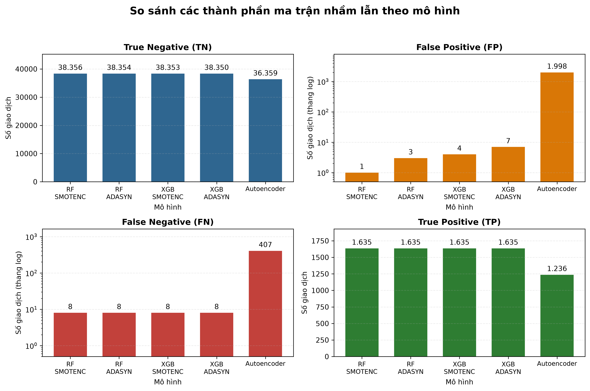
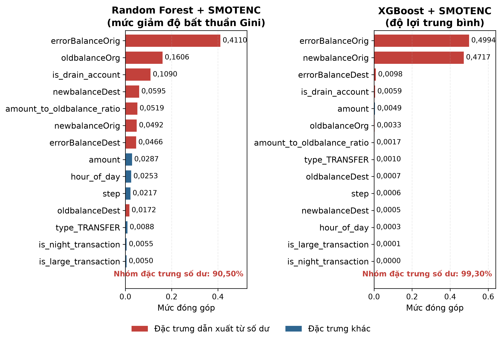

# HỆ THỐNG PHÁT HIỆN GIAO DỊCH TÀI CHÍNH BẤT THƯỜNG VÀ NGHI VẤN GIAN LẬN

**Môn học:** CS106 — Trí tuệ Nhân tạo  
**Nhóm:** 9  
**Người soạn bản nháp Sprint 3:** Vũ Văn Duy — MSSV 26410031 — Lớp A
**Phiên bản:** Bản nháp Sprint 3 — Chương 1 đến Chương 6
**Ngày cập nhật:** 04/09/2026

| STT | Họ và tên | MSSV | Lớp |
|---:|---|---:|:---:|
| 1 | Trần Hoàng Hôn | 26410046 | A |
| 2 | Nguyễn Duy Khang | 26410055 | A |
| 3 | Vũ Văn Duy | 26410031 | A |
| 4 | Phạm Thành Trung | 26410141 | A |
| 5 | Đặng Chí Thanh | 25730067 | B |
| 6 | Bùi Thị Mỷ Cẩm | 25730013 | B |
| 7 | Hoàng Cao Sơn | 25730061 | B |

> Phạm vi bản nháp Sprint 3: trình bày phần Giới thiệu, Phát biểu bài toán, Mô tả dữ liệu, Phương pháp thực hiện, Kết quả thực nghiệm và Thảo luận. Phần Kết luận và Tóm tắt sẽ được hoàn thiện sau khi bảng so sánh tổng hợp và các biểu đồ ROC, Precision–Recall của bước đánh giá chéo được kiểm tra thống nhất.

---

# CHƯƠNG 1. GIỚI THIỆU

## 1.1. Bối cảnh

Sự phát triển của các hệ thống thương mại điện tử, thanh toán trực tuyến và dịch vụ tài chính trên thiết bị di động làm cho số lượng giao dịch điện tử tăng nhanh. Song song với sự thuận tiện đó, các tổ chức tài chính phải đối mặt với những hành vi gian lận ngày càng đa dạng. Theo khảo sát của Abdallah và cộng sự [1], phát hiện gian lận là một bài toán phức tạp vì dữ liệu thường có quy mô lớn, phân bố lệch, thay đổi theo thời gian và có thể tạo ra nhiều cảnh báo giả. Vì vậy, hệ thống không chỉ cần nhận biết giao dịch có dấu hiệu bất thường mà còn phải hạn chế cảnh báo nhầm đối với giao dịch hợp lệ.

Trong bài toán phân loại giao dịch, mỗi giao dịch được mô tả bởi một tập đặc trưng như thời điểm, loại giao dịch, số tiền và biến động số dư. Hệ thống học máy nhận các đặc trưng này và dự đoán giao dịch thuộc lớp hợp lệ hay gian lận. Khác với bài toán phân loại cân bằng, số giao dịch gian lận thường rất nhỏ so với số giao dịch bình thường. Nếu chỉ tối ưu Accuracy, một mô hình dự đoán tất cả giao dịch là bình thường vẫn có thể đạt tỷ lệ đúng cao nhưng không đáp ứng mục tiêu phát hiện gian lận.

Một khó khăn khác là dữ liệu giao dịch thực tế có tính nhạy cảm cao và ít khi được công bố. Công trình PaySim [2] được xây dựng nhằm tạo dữ liệu giao dịch mobile money tổng hợp dựa trên đặc tính thống kê của dữ liệu thật, qua đó hỗ trợ nghiên cứu mà không công khai nhật ký giao dịch riêng tư. Bộ dữ liệu PaySim công bố trên Kaggle [3] vì vậy phù hợp với phạm vi học thuật của đề tài, nhưng kết quả thu được cần được diễn giải trong giới hạn của dữ liệu mô phỏng.

## 1.2. Lý do chọn đề tài

Đề tài “Hệ thống phát hiện giao dịch tài chính bất thường và nghi vấn gian lận” kết hợp nhiều nội dung quan trọng của môn Trí tuệ Nhân tạo: biểu diễn dữ liệu, tiền xử lý, học có giám sát, phát hiện bất thường, xử lý dữ liệu mất cân bằng và đánh giá mô hình. Đây cũng là bài toán có ý nghĩa thực tiễn rõ ràng vì quyết định của mô hình liên quan trực tiếp đến hai loại rủi ro:

- **False Negative:** giao dịch gian lận không được phát hiện, có thể gây thiệt hại tài chính.
- **False Positive:** giao dịch hợp lệ bị gắn cờ nhầm, làm gián đoạn trải nghiệm người dùng và tăng chi phí kiểm tra.

Do đó, nhóm không sử dụng Accuracy như tiêu chí duy nhất. Báo cáo tập trung vào Precision, Recall, F1-Score và ROC-AUC theo yêu cầu của đề bài. Các chỉ số này cho phép phân tích rõ hơn khả năng phát hiện lớp gian lận và sự đánh đổi giữa bỏ sót với cảnh báo nhầm.

## 1.3. Mục tiêu đề tài

### 1.3.1. Mục tiêu tổng quát

Xây dựng và đánh giá một quy trình học máy có khả năng phân loại giao dịch tài chính mobile money thành hai nhóm: giao dịch hợp lệ và giao dịch có dấu hiệu gian lận.

### 1.3.2. Mục tiêu cụ thể

1. Khảo sát và mô tả bộ dữ liệu PaySim, bao gồm cấu trúc, phân bố loại giao dịch và tỷ lệ gian lận.
2. Xây dựng quy trình tiền xử lý có thể tái sử dụng: lọc dữ liệu, tạo đặc trưng, mã hóa biến phân loại, chuẩn hóa và chia train/test.
3. Khảo sát các kỹ thuật xử lý mất cân bằng như SMOTE và ADASYN trên tập huấn luyện, không thay đổi tập kiểm tra.
4. Thử nghiệm ít nhất hai thuật toán trong số Random Forest, XGBoost và Autoencoder theo yêu cầu đề bài.
5. Đánh giá mô hình bằng Precision, Recall, F1-Score, ROC-AUC và các biểu đồ phù hợp.
6. So sánh mô hình, phân tích hạn chế và đề xuất hướng phát triển.
7. Chuẩn bị một giao diện minh họa để nhập thông tin giao dịch và hiển thị dự đoán khi mô hình cuối đã sẵn sàng.

> Bản nháp hiện tại đã mô tả quy trình tiền xử lý, xử lý mất cân bằng và ba họ mô hình. Các kết luận thực nghiệm vẫn được giới hạn trong tập kiểm tra PaySim đã xử lý và sẽ được rà soát lại trước khi hoàn thiện báo cáo cuối.

## 1.4. Đối tượng và phạm vi nghiên cứu

- **Đối tượng nghiên cứu:** giao dịch mobile money trong bộ dữ liệu tổng hợp PaySim.
- **Bài toán:** phân loại nhị phân, với `isFraud = 0` là giao dịch bình thường và `isFraud = 1` là giao dịch gian lận.
- **Phạm vi dữ liệu:** bộ dữ liệu PaySim công khai trên Kaggle, tập làm việc của nhóm được lọc còn hai loại `TRANSFER` và `CASH_OUT`, sau đó downsample còn 200.000 giao dịch.
- **Phạm vi thuật toán:** Random Forest, XGBoost và Autoencoder. SMOTENC/ADASYN được áp dụng để xử lý mất cân bằng trên train set.
- **Phạm vi đánh giá:** đánh giá trên test set được tách từ tập 200.000 giao dịch đã downsample.
- **Ngoài phạm vi:** triển khai production, xử lý giao dịch thời gian thực, kết nối hệ thống ngân hàng thật và khẳng định hiệu quả trên dữ liệu tài chính thực tế. PaySim không cung cấp tọa độ hay vị trí giao dịch, nên nhóm không thể xây dựng đặc trưng khoảng cách địa lý giữa các lần giao dịch. Đây là một giới hạn so với danh sách đặc trưng gợi ý trong đề bài.

## 1.5. Cấu trúc báo cáo dự kiến

- Chương 1 giới thiệu bối cảnh, mục tiêu và phạm vi.
- Chương 2 phát biểu bài toán và các yêu cầu kỹ thuật.
- Chương 3 mô tả dữ liệu và kết quả EDA.
- Chương 4 trình bày phương pháp tiền xử lý, xử lý mất cân bằng và các mô hình.
- Chương 5 trình bày kết quả thực nghiệm.
- Chương 6 thảo luận kết quả và hạn chế.
- Chương 7 kết luận và hướng phát triển.
- Phần cuối gồm tài liệu tham khảo và phụ lục mô tả chương trình.

---

# CHƯƠNG 2. PHÁT BIỂU BÀI TOÁN

## 2.1. Mô tả bài toán

Cho tập dữ liệu giao dịch tài chính, mỗi giao dịch được biểu diễn bởi vector đặc trưng $x$. Mục tiêu là xây dựng hàm dự đoán $f(x)$ trả về một trong hai nhãn:

- $f(x) = 0$: giao dịch hợp lệ.
- $f(x) = 1$: giao dịch gian lận.

Sau tiền xử lý và xây dựng đặc trưng, vector đầu vào gồm 14 đặc trưng: 10 biến định lượng được chuẩn hóa và bốn cờ nhị phân. Nhóm đặc trưng này kết hợp thông tin thời gian, số tiền, số dư, sai lệch số dư, tỷ lệ số tiền trên số dư nguồn và loại giao dịch. Nhãn cần dự đoán là `isFraud`.

Vì tỷ lệ gian lận thấp hơn nhiều so với giao dịch bình thường, bài toán không chỉ là tìm một đường phân tách giữa hai lớp. Mô hình còn phải học được tín hiệu của lớp thiểu số trong khi hạn chế cảnh báo nhầm. Việc lựa chọn cách lấy mẫu, thuật toán và ngưỡng dự đoán có thể làm thay đổi cân bằng giữa Precision và Recall.

## 2.2. Đầu vào và đầu ra

### Đầu vào

Một giao dịch sau khi tiền xử lý, gồm:

- thời điểm giao dịch theo đơn vị `step`.
- số tiền giao dịch.
- số dư tài khoản nguồn trước và sau giao dịch.
- số dư tài khoản đích trước và sau giao dịch.
- hai đặc trưng chênh lệch số dư.
- giờ trong ngày và tỷ lệ số tiền trên số dư nguồn.
- ba cờ nghiệp vụ: rút cạn tài khoản, giao dịch ban đêm và giao dịch lớn.
- loại giao dịch được mã hóa thành `type_TRANSFER`.

### Đầu ra

- Nhãn dự đoán `0` hoặc `1`.
- Xác suất/điểm bất thường nếu mô hình hỗ trợ.
- Trong demo cuối: thông báo giao dịch bình thường hoặc có nghi vấn gian lận.

## 2.3. Các thách thức chính

### 2.3.1. Mất cân bằng lớp

Dữ liệu PaySim gốc có 8.213 giao dịch gian lận trên tổng số 6.362.620 giao dịch, tương đương 0,129082%. Tỷ lệ này khiến lớp gian lận dễ bị lấn át khi huấn luyện. Nhóm đã downsample lớp bình thường để tạo tập làm việc có 200.000 dòng và tỷ lệ gian lận khoảng 4,1065%. Thao tác này giúp giảm chi phí tính toán nhưng làm thay đổi phân bố lớp so với dữ liệu gốc, vì vậy kết quả phải được diễn giải thận trọng.

### 2.3.2. Chi phí của hai loại sai số

False Negative và False Positive không có tác động giống nhau. Bỏ sót giao dịch gian lận có thể dẫn đến tổn thất, trong khi cảnh báo nhầm làm tăng chi phí xác minh và ảnh hưởng người dùng. Do đề bài chưa đưa ra ma trận chi phí cụ thể, nhóm sẽ báo cáo nhiều chỉ số thay vì kết luận dựa trên một metric duy nhất.

### 2.3.3. Rò rỉ dữ liệu

Các bước học tham số từ dữ liệu, chẳng hạn chuẩn hóa hoặc sinh mẫu tổng hợp, chỉ được thực hiện trên tập huấn luyện. Tập kiểm tra được tách trước khi khớp `StandardScaler` và không tham gia SMOTENC hay ADASYN. Cách tổ chức này giữ tập kiểm tra độc lập để phản ánh khách quan hơn khả năng tổng quát hóa của mô hình.

### 2.3.4. Dữ liệu mô phỏng

Theo công trình gốc và data card [2], [3], PaySim được sinh bằng mô phỏng dựa trên dữ liệu mobile money tổng hợp từ thống kê của nhật ký thật. Vì vậy, mô hình có thể học các quy luật đặc trưng của simulator thay vì toàn bộ hành vi phức tạp trong hệ thống tài chính thực. Đây là giới hạn ngoại suy quan trọng của đề tài.

## 2.4. Yêu cầu kỹ thuật

Theo đề bài môn học, hệ thống cần:

1. Sử dụng bộ dữ liệu công khai hoặc synthetic với tối thiểu 500 giao dịch.
2. Tiền xử lý và chuẩn hóa dữ liệu định lượng.
3. Thử nghiệm ít nhất hai thuật toán trong số Random Forest, XGBoost hoặc Autoencoder.
4. Xử lý mất cân bằng bằng SMOTE, ADASYN hoặc class weights.
5. Đánh giá bằng Precision, Recall, F1-Score và ROC-AUC, không dùng Accuracy đơn thuần.
6. Có code, báo cáo khoa học, mô tả chương trình và demo/hình ảnh nếu có.

Đề bài còn liệt kê khoảng cách địa lý giữa các lần giao dịch trong nhóm đặc trưng cần xem xét. Tuy nhiên, PaySim không có tọa độ, địa chỉ hoặc trường vị trí để tính đặc trưng này. Nhóm giữ PaySim vì bộ dữ liệu có nhãn fraud, chuỗi thời gian, loại dịch vụ và biến động số dư phù hợp với phần còn lại của bài toán. Thiếu dữ liệu địa lý được công khai như một giới hạn thay vì tự sinh vị trí không có nguồn gốc.

## 2.5. Câu hỏi nghiên cứu

Báo cáo hướng tới trả lời các câu hỏi sau khi hoàn tất thực nghiệm:

- Kỹ thuật xử lý mất cân bằng nào phù hợp hơn trên tập PaySim đã tiền xử lý?
- Trong các mô hình được thử nghiệm, mô hình nào đạt cân bằng tốt nhất giữa Precision và Recall cho lớp fraud?
- Các đặc trưng nào đóng góp nhiều nhất vào quyết định của mô hình, và các đặc trưng này có nguy cơ phản ánh cơ chế mô phỏng của PaySim hay không?

---

# CHƯƠNG 3. MÔ TẢ DỮ LIỆU

## 3.1. Nguồn dữ liệu

Nhóm sử dụng bộ “Synthetic Financial Datasets for Fraud Detection” do Edgar Lopez-Rojas công bố trên Kaggle [3]. Bộ dữ liệu được sinh từ PaySim, một simulator giao dịch mobile money dựa trên đặc tính của một mẫu nhật ký giao dịch thực. Công trình gốc về PaySim [2] mô tả đây là một cách tạo dữ liệu tổng hợp để hỗ trợ nghiên cứu trong bối cảnh dữ liệu tài chính thật khó tiếp cận vì tính riêng tư.

Theo data card của bộ dữ liệu [3], mỗi `step` tương ứng một giờ và bộ dữ liệu mô phỏng khoảng một tháng hoạt động. Năm loại giao dịch gồm `CASH_IN`, `CASH_OUT`, `DEBIT`, `PAYMENT` và `TRANSFER`.

## 3.2. Cấu trúc dữ liệu gốc

| Thuộc tính | Kiểu/nhóm | Ý nghĩa |
|---|---|---|
| `step` | Thời gian | Một đơn vị tương ứng một giờ mô phỏng |
| `type` | Phân loại | Loại giao dịch |
| `amount` | Định lượng | Số tiền giao dịch |
| `nameOrig` | Định danh | Tài khoản khởi tạo giao dịch |
| `oldbalanceOrg` | Định lượng | Số dư nguồn trước giao dịch |
| `newbalanceOrig` | Định lượng | Số dư nguồn sau giao dịch |
| `nameDest` | Định danh | Tài khoản nhận |
| `oldbalanceDest` | Định lượng | Số dư đích trước giao dịch |
| `newbalanceDest` | Định lượng | Số dư đích sau giao dịch |
| `isFraud` | Nhãn | 1 là fraud, 0 là normal |
| `isFlaggedFraud` | Cờ nghiệp vụ | Cờ giao dịch chuyển khoản lớn theo rule của simulator |

Notebook EDA xác nhận file gốc có **6.362.620 dòng và 11 cột**, không có giá trị thiếu trong 11 cột được kiểm tra. Tập dữ liệu gồm **6.354.407 giao dịch bình thường** và **8.213 giao dịch gian lận**.

## 3.3. Phân bố giao dịch và nhãn

| Loại giao dịch | Normal | Fraud | Tổng |
|---|---:|---:|---:|
| `CASH_IN` | 1.399.284 | 0 | 1.399.284 |
| `CASH_OUT` | 2.233.384 | 4.116 | 2.237.500 |
| `DEBIT` | 41.432 | 0 | 41.432 |
| `PAYMENT` | 2.151.495 | 0 | 2.151.495 |
| `TRANSFER` | 528.812 | 4.097 | 532.909 |
| **Tổng** | **6.354.407** | **8.213** | **6.362.620** |

Trong lần phân tích dữ liệu hiện tại, toàn bộ giao dịch gian lận xuất hiện ở `TRANSFER` và `CASH_OUT`. Vì vậy, nhóm lọc hai loại giao dịch này trước khi downsampling lớp bình thường. Nhận định trên chỉ phản ánh bộ PaySim đang sử dụng, không phải quy luật chung cho mọi hệ thống tài chính.

## 3.4. Downsampling và chia tập

Để giảm yêu cầu bộ nhớ và thời gian huấn luyện, pipeline giữ toàn bộ 8.213 giao dịch fraud và lấy mẫu ngẫu nhiên 191.787 giao dịch normal với `random_state = 42`. Tập làm việc sau downsample có đúng 200.000 giao dịch.

| Tập dữ liệu | Normal | Fraud | Tổng | Fraud ratio |
|---|---:|---:|---:|---:|
| Dữ liệu gốc | 6.354.407 | 8.213 | 6.362.620 | 0,129082% |
| Sau downsample | 191.787 | 8.213 | 200.000 | 4,106500% |
| Train | 153.430 | 6.570 | 160.000 | 4,106250% |
| Test | 38.357 | 1.643 | 40.000 | 4,107500% |

Tập huấn luyện và tập kiểm tra được chia theo tỷ lệ 80/20 bằng phương pháp phân tầng theo nhãn. Cách chia này giữ tỷ lệ gian lận của hai tập gần nhau. Tập kiểm tra gồm 40.000 giao dịch và được giữ nguyên, không áp dụng SMOTENC hoặc ADASYN.

## 3.5. Các đặc trưng đầu vào sau tiền xử lý

Quy trình loại `nameOrig`, `nameDest` và `isFlaggedFraud`, mã hóa `type`, đồng thời tạo bảy đặc trưng dẫn xuất. Mười biến định lượng được `StandardScaler` khớp trên tập huấn luyện và dùng cùng tham số để biến đổi tập kiểm tra. Bốn biến nhị phân được giữ ở miền giá trị 0/1.

| # | Feature cuối | Nguồn/xử lý |
|---:|---|---|
| 1 | `step` | Gốc + StandardScaler |
| 2 | `amount` | Gốc + StandardScaler |
| 3 | `oldbalanceOrg` | Gốc + StandardScaler |
| 4 | `newbalanceOrig` | Gốc + StandardScaler |
| 5 | `oldbalanceDest` | Gốc + StandardScaler |
| 6 | `newbalanceDest` | Gốc + StandardScaler |
| 7 | `hour_of_day` | `step mod 24` + StandardScaler |
| 8 | `amount_to_oldbalance_ratio` | `amount / (oldbalanceOrg + 10^-5)` + StandardScaler |
| 9 | `errorBalanceOrig` | `oldbalanceOrg - amount - newbalanceOrig` + StandardScaler |
| 10 | `errorBalanceDest` | `oldbalanceDest + amount - newbalanceDest` + StandardScaler |
| 11 | `is_drain_account` | Cờ nhị phân: số dư nguồn từ dương về 0 |
| 12 | `is_night_transaction` | Cờ nhị phân: `hour_of_day < 6` |
| 13 | `is_large_transaction` | Cờ nhị phân: `amount > 200000` |
| 14 | `type_TRANSFER` | One-hot/dummy binary |

## 3.6. Hạn chế và nguy cơ ảnh hưởng tính hợp lệ

### 3.6.1. Thay đổi tỷ lệ lớp

Fraud ratio tăng từ 0,129082% lên khoảng 4,1065% sau downsample. Do Precision và đường Precision–Recall phụ thuộc vào prevalence, kết quả trên test downsample không thể được trình bày như hiệu năng trên phân bố PaySim gốc hoặc trên hệ thống thật.

### 3.6.2. Cảnh báo về các cột balance

Data card của Kaggle [3] lưu ý rằng giao dịch bị phát hiện là gian lận trong bộ mô phỏng có thể bị hủy và khuyến cáo không sử dụng các cột `oldbalanceOrg`, `newbalanceOrig`, `oldbalanceDest`, `newbalanceDest` để phát hiện gian lận. Quy trình hiện tại vẫn sử dụng các cột số dư và hai đặc trưng sai lệch số dư. Vì vậy, mô hình có thể học tín hiệu phát sinh từ cơ chế cập nhật hoặc hủy giao dịch của bộ mô phỏng. Mục 5.5 cho thấy nhóm đặc trưng này thực sự chiếm phần lớn mức đóng góp của cả Random Forest và XGBoost. Báo cáo xem đây là một nguy cơ ảnh hưởng tính hợp lệ. Phép kiểm tra dứt điểm là huấn luyện lại mô hình sau khi loại nhóm đặc trưng số dư rồi so sánh hiệu năng. Thí nghiệm này nằm ngoài phạm vi bản nháp hiện tại và được ghi nhận như một hướng kiểm chứng cần thực hiện trước khi khẳng định kết quả.

### 3.6.3. Dữ liệu tổng hợp

PaySim hỗ trợ thử nghiệm có thể tái lập nhưng không đại diện hoàn toàn cho hành vi, quy trình nghiệp vụ và chiến thuật gian lận trong môi trường thật. Kết quả của đồ án chỉ nên được xem là kết quả trên bộ dữ liệu mô phỏng.

### 3.6.4. Cách chia dữ liệu

Quy trình hiện tại sử dụng phép chia ngẫu nhiên có phân tầng thay vì chia theo thời gian hoặc theo tài khoản. Cách chia này phù hợp với mô hình cơ sở của đồ án nhưng chưa chứng minh khả năng dự báo giao dịch trong khoảng thời gian tương lai hoặc đối với tài khoản chưa từng xuất hiện.

### 3.6.5. Thiếu thông tin địa lý

PaySim không cung cấp vị trí của giao dịch nên không thể tính khoảng cách giữa hai lần giao dịch liên tiếp. Việc tự gán tọa độ giả có thể tạo tín hiệu không phản ánh dữ liệu gốc, vì vậy nhóm không bổ sung đặc trưng địa lý nhân tạo. Giới hạn này cần được cân nhắc khi đối chiếu sản phẩm với yêu cầu đề bài và khi suy rộng sang hệ thống phát hiện gian lận thực tế.

## 3.7. Kết luận chương

Bộ dữ liệu PaySim đáp ứng yêu cầu về quy mô và cung cấp nhãn gian lận rõ ràng. Quy trình chuẩn bị dữ liệu gồm phân tích khám phá, downsampling lớp bình thường, chia dữ liệu có phân tầng, xây dựng 14 đặc trưng, mã hóa và chuẩn hóa. Tuy nhiên, tỷ lệ lớp đã thay đổi đáng kể, nhóm đặc trưng số dư có nguy cơ phản ánh cơ chế của bộ mô phỏng và dữ liệu không có thông tin địa lý. Các giới hạn này được xem xét xuyên suốt phần phương pháp và thảo luận.

---

# CHƯƠNG 4. PHƯƠNG PHÁP THỰC HIỆN

## 4.1. Quy trình thực nghiệm

Quy trình thực nghiệm được tổ chức thành sáu bước tuần tự:

- **Bước 1 — Đọc và kiểm tra dữ liệu:** nạp bộ PaySim, xác nhận cấu trúc cột, kiểu dữ liệu, giá trị thiếu và phân bố nhãn.
- **Bước 2 — Lọc và downsampling:** giữ hai loại giao dịch `TRANSFER` và `CASH_OUT`, bảo toàn toàn bộ giao dịch gian lận và lấy mẫu ngẫu nhiên lớp bình thường để tạo tập làm việc 200.000 giao dịch.
- **Bước 3 — Chia dữ liệu:** tách tập huấn luyện và tập kiểm tra theo tỷ lệ 80/20 bằng phép chia phân tầng (stratified) theo nhãn.
- **Bước 4 — Xây dựng đặc trưng:** tạo các đặc trưng dẫn xuất, mã hóa loại giao dịch và chuẩn hóa các biến định lượng bằng tham số học từ tập huấn luyện.
- **Bước 5 — Xử lý mất cân bằng:** áp dụng oversampling bằng SMOTENC hoặc ADASYN trên tập huấn luyện, không thay đổi tập kiểm tra.
- **Bước 6 — Huấn luyện và đánh giá:** huấn luyện Random Forest, XGBoost và Autoencoder, sau đó đánh giá tất cả mô hình trên cùng tập kiểm tra.

Toàn bộ thao tác ngẫu nhiên sử dụng `random_state = 42`. `StandardScaler` chỉ được khớp trên tập huấn luyện. SMOTENC và ADASYN cũng chỉ nhận dữ liệu huấn luyện. Tập kiểm tra không tham gia bất kỳ bước học tham số hoặc oversampling nào.

## 4.2. Tiền xử lý và xây dựng đặc trưng

Sau khi lọc hai loại giao dịch có gian lận, nhóm giữ toàn bộ 8.213 mẫu gian lận và lấy ngẫu nhiên 191.787 mẫu bình thường. Tập 200.000 giao dịch được trộn lại trước khi chia có phân tầng thành 160.000 mẫu huấn luyện và 40.000 mẫu kiểm tra.

Hai cột định danh `nameOrig` và `nameDest` bị loại vì có số lượng giá trị riêng biệt rất lớn. Cột `isFlaggedFraud` cũng bị loại khỏi vector đầu vào do độ phủ thấp và có nguy cơ phản ánh một quy tắc riêng của bộ mô phỏng. Bảy đặc trưng dẫn xuất được xây dựng từ thời gian, số tiền và biến động số dư như trình bày tại Mục 3.5.

Hàm `pandas.get_dummies(..., drop_first=True)` mã hóa loại giao dịch thành `type_TRANSFER`, sau đó hai tập dữ liệu được căn chỉnh về cùng thứ tự cột. `StandardScaler` được khớp trên 10 biến định lượng của tập huấn luyện và dùng cùng tham số để biến đổi tập kiểm tra. Bốn cờ nhị phân được giữ nguyên ở miền giá trị 0/1.

## 4.3. Xử lý mất cân bằng

Tập huấn luyện ban đầu có 153.430 mẫu bình thường và 6.570 mẫu gian lận. Nhóm khảo sát hai phương pháp oversampling lớp thiểu số là SMOTENC và ADASYN.

SMOTE [4] tạo mẫu tổng hợp bằng cách nội suy giữa các điểm lớp thiểu số lân cận. Do vector đầu vào có bốn cờ nhị phân, quy trình sử dụng biến thể `SMOTENC` để nhận biết và xử lý riêng các chiều phân loại.

ADASYN [5] phân bổ nhiều mẫu tổng hợp hơn cho những quan sát thiểu số khó phân loại. Quy trình hiện tại không có biến thể ADASYN chuyên biệt cho dữ liệu phân loại, vì vậy bốn cột nhị phân được làm tròn về 0/1 sau khi oversampling.

Cả hai phương pháp dùng `sampling_strategy = 0.5` và `k_neighbors = 5`, tương ứng tỷ lệ gian lận:bình thường mục tiêu là 1:2. SMOTENC tạo tập 230.145 × 14 với 33,33% giao dịch gian lận. ADASYN tạo tập 230.411 × 14 với 33,41% giao dịch gian lận. Kiểm tra tính toàn vẹn xác nhận bốn cột nhị phân chỉ chứa 0/1. Tập kiểm tra vẫn giữ nguyên 40.000 dòng và tỷ lệ gian lận 4,1075%.

Trong quy trình hiện tại, oversampling được thực hiện một lần trên toàn bộ tập huấn luyện trước khi đưa dữ liệu đã cân bằng vào `RandomizedSearchCV`. SMOTENC và ADASYN chưa được đặt trong một `imblearn.Pipeline` để chạy độc lập trên từng fold. Vì vậy, điểm cross-validation có thể lạc quan hơn thực tế do mẫu tổng hợp sinh từ một fold có thể rò rỉ sang fold kiểm định. Kết quả so sánh cuối vì thế ưu tiên các chỉ số trên tập kiểm tra được giữ riêng.

## 4.4. Random Forest

Random Forest [6] huấn luyện nhiều cây quyết định trên các mẫu bootstrap khác nhau, mỗi lần tách nút chỉ xét một tập con đặc trưng được chọn ngẫu nhiên, rồi tổng hợp dự đoán của toàn bộ cây bằng bỏ phiếu. Cơ chế này làm giảm phương sai so với một cây đơn lẻ. Nhóm huấn luyện hai biến thể trên dữ liệu SMOTENC và ADASYN. Quá trình tìm kiếm siêu tham số dùng `RandomizedSearchCV` với 50 cấu hình, cross-validation 5-fold và F1 của lớp gian lận làm hàm mục tiêu.

Cấu hình tốt nhất trên SMOTENC gồm `n_estimators = 200`, `max_depth = 20`, `min_samples_split = 2`, `min_samples_leaf = 1`, `max_features = sqrt` và `class_weight = balanced_subsample`. Cấu hình ADASYN giữ cùng `max_depth` và `class_weight` nhưng chọn 500 cây. Hai mô hình trả về cả nhãn dự đoán và xác suất của lớp gian lận, phục vụ đồng thời các chỉ số theo ngưỡng và các chỉ số xếp hạng.

## 4.5. XGBoost

XGBoost [7] là một hệ thống gradient boosting trên cây quyết định, bổ sung các cải tiến về xử lý dữ liệu thưa, thuật toán tìm điểm tách xấp xỉ theo histogram và khả năng mở rộng trên dữ liệu lớn. Quy trình sử dụng `XGBClassifier` với `objective = binary:logistic`, `tree_method = hist` và `eval_metric = aucpr`. Vì tập huấn luyện đã qua oversampling, `scale_pos_weight` được giữ ở 1,0 để không cộng dồn thêm trọng số cho lớp gian lận.

Quá trình tìm kiếm siêu tham số dùng `RandomizedSearchCV` với 20 cấu hình, cross-validation 3-fold và chỉ số F1. Cấu hình tốt nhất trên SMOTENC gồm 300 cây, `max_depth = 8`, `learning_rate = 0.2`, `subsample = 0.85`, `colsample_bytree = 1.0`, `min_child_weight = 3` và `gamma = 0.1`. Nhóm cũng huấn luyện biến thể ADASYN để so sánh tác động của phương pháp oversampling.

## 4.6. Autoencoder theo hướng phát hiện bất thường

Autoencoder [8] học cách tái tạo lại chính vector đầu vào sau khi ép nó qua một lớp ẩn có số chiều nhỏ hơn. Vì lớp ẩn này không đủ chỗ để ghi nhớ toàn bộ thông tin, mạng buộc phải học biểu diễn nén của những mẫu hình phổ biến nhất trong dữ liệu huấn luyện. Do TensorFlow/Keras chưa có bản tương thích với môi trường Python 3.14, nhóm triển khai nguyên lý này bằng `sklearn.neural_network.MLPRegressor`.

Mạng nhận và trả về vector 14 chiều, giữa hai đầu là năm lớp ẩn nên toàn bộ kiến trúc là `14 → 16 → 8 → 4 → 8 → 16 → 14`, trong đó lớp bốn nút đóng vai trò bottleneck. Tham số `hidden_layer_sizes` của `MLPRegressor` chỉ khai báo phần lớp ẩn `(16, 8, 4, 8, 16)`, còn số chiều đầu vào và đầu ra do dữ liệu quyết định khi gọi `fit(X, X)`. Mô hình dùng hàm kích hoạt ReLU, thuật toán tối ưu Adam, `batch_size = 256`, `learning_rate_init = 0.001` và `max_iter = 200`. Lần huấn luyện hiện tại chạy hết 200 epoch, nghĩa là cơ chế early stopping chưa dừng mô hình trước giới hạn này.

Mô hình chỉ học từ các giao dịch bình thường, nhờ đó giao dịch gian lận trở thành trường hợp mà mạng chưa từng học cách tái tạo. Sau khi tách một phần tập huấn luyện làm tập validation, phần dùng để khớp mạng còn 122.744 mẫu bình thường. Sai số tái tạo của mỗi giao dịch được tính bằng sai số bình phương trung bình (MSE) giữa vector đầu vào và vector tái tạo, rồi dùng làm điểm bất thường (anomaly score).

Ngưỡng phân loại được chọn bằng cách quét nhiều mức phân vị của sai số tái tạo trên tập validation. Trong các mức đạt ràng buộc Recall tối thiểu 0,60, mức phân vị 95 cho F1 cao nhất và được chọn, tương ứng ngưỡng 0,045456. Giao dịch có sai số vượt ngưỡng được gán nhãn gian lận. Cần lưu ý điểm bất thường này không phải xác suất đã hiệu chuẩn, nên chỉ dùng để xếp hạng chứ không diễn giải như mức tin cậy.

## 4.7. Quy trình đánh giá

Các mô hình được đánh giá trên cùng tập kiểm tra 40.000 giao dịch, không dùng dữ liệu đã qua oversampling. Báo cáo tập trung vào lớp gian lận với bốn chỉ số chính là Precision, Recall, F1-Score và ROC-AUC. Average Precision được báo cáo bổ sung vì phản ánh chất lượng phát hiện lớp gian lận rõ hơn ROC-AUC khi dữ liệu mất cân bằng. Đường ROC và đường Precision–Recall tổng hợp sẽ được bổ sung trong bản báo cáo cuối.

Ma trận nhầm lẫn được đọc theo bốn thành phần TN, FP, FN và TP. Vì bốn đại lượng này chênh nhau nhiều bậc độ lớn, chúng được biểu diễn trên bốn đồ thị riêng thay vì gộp chung một trục tung. Mọi chỉ số đều được tính lại từ cùng một tệp nhãn thật và cùng các tệp dự đoán đã lưu, để loại trừ khác biệt do cách tính.

## 4.8. Khả năng tái lập và giới hạn phương pháp

Toàn bộ thao tác ngẫu nhiên dùng `random_state = 42`. `StandardScaler`, dữ liệu đã xử lý, mô hình và đầu ra dự đoán đều được lưu lại để có thể tái lập phép đánh giá mà không cần huấn luyện lại.

Tuy nhiên, phương pháp hiện tại còn năm giới hạn cần nêu rõ. Thứ nhất, tỷ lệ gian lận trong tập kiểm tra cao hơn PaySim gốc do downsampling lớp bình thường, nên Precision và Average Precision không suy rộng được sang phân bố gốc. Thứ hai, phép chia phân tầng ngẫu nhiên chưa thay thế được phép chia theo thời gian, nên chưa kiểm chứng được khả năng dự báo cho giai đoạn tương lai. Thứ ba, oversampling chưa chạy độc lập trên từng fold nên điểm cross-validation có thể lạc quan. Thứ tư, nhóm đặc trưng số dư có thể phản ánh cơ chế cập nhật của bộ mô phỏng thay vì hành vi gian lận, mức độ ảnh hưởng được định lượng tại Mục 5.5. Thứ năm, tập validation của Autoencoder được tách sau khi `StandardScaler` đã khớp trên toàn bộ tập huấn luyện, nên ngưỡng chọn trên tập này chịu một phần ảnh hưởng của thông tin ngoài nó. Ngoài ra, dữ liệu không có thông tin vị trí để đánh giá tín hiệu khoảng cách địa lý như đề bài gợi ý.

## 4.9. Kết luận chương

Phương pháp thực hiện kết hợp quy trình tiền xử lý hạn chế rò rỉ dữ liệu, hai kỹ thuật xử lý mất cân bằng, hai mô hình học có giám sát và một mô hình phát hiện bất thường. Vì mọi biến thể đều được đánh giá trên đúng một tập kiểm tra 40.000 giao dịch chưa qua oversampling, các con số ở Chương 5 so sánh được trực tiếp với nhau. Chương 5 trình bày kết quả định lượng, phân tích sai số và mức đóng góp của đặc trưng theo đúng quy trình đánh giá vừa mô tả.

---

# CHƯƠNG 5. KẾT QUẢ THỰC NGHIỆM

## 5.1. Phạm vi và nguồn kết quả

Chương này đánh giá năm biến thể mô hình trên cùng 40.000 giao dịch của tập kiểm tra chưa qua oversampling. Precision, Recall và F1-Score được tính cho lớp gian lận. ROC-AUC và Average Precision sử dụng điểm dự đoán liên tục của từng mô hình. Các giá trị được trình bày với bốn chữ số thập phân để tránh cách làm tròn 1,00 che khuất khác biệt nhỏ.

Toàn bộ chỉ số trong chương được tính lại từ cùng một tệp nhãn thật và các tệp đầu ra dự đoán đã lưu, bằng script `run_report_metrics.py` gọi hàm `compute_metrics` trong `src/evaluation/`. Kết quả tính lại được ghi ra `reports/ch5_metrics_recomputed.csv` để người đọc có thể đối chiếu từng con số. Bảng so sánh, hai biểu đồ và bảng mức đóng góp của đặc trưng dưới đây đều được sinh lại bằng cùng script đó, phản ánh kết quả hiện có trên tập kiểm tra. Đường ROC và đường Precision–Recall tổng hợp sẽ được bổ sung trong bản báo cáo cuối.

## 5.2. So sánh hiệu năng các mô hình

**Bảng 5.1. So sánh bốn chỉ số chính và Average Precision trên lớp gian lận**

| Mô hình | Precision | Recall | F1-Score | ROC-AUC | Average Precision |
|---|---:|---:|---:|---:|---:|
| Random Forest + SMOTENC | 0,9994 | 0,9951 | **0,9973** | 0,9994 | 0,9983 |
| Random Forest + ADASYN | 0,9982 | 0,9951 | 0,9966 | 0,9992 | 0,9978 |
| XGBoost + SMOTENC | 0,9976 | 0,9951 | 0,9963 | 0,9993 | 0,9969 |
| XGBoost + ADASYN | 0,9957 | 0,9951 | 0,9954 | 0,9994 | 0,9976 |
| Autoencoder | 0,3822 | 0,7523 | 0,5069 | 0,9318 | 0,5973 |

Random Forest kết hợp SMOTENC đạt F1-Score cao nhất là 0,9973, đồng thời có Precision 0,9994 và Recall 0,9951. Ba biến thể học có giám sát còn lại có F1-Score từ 0,9954 đến 0,9966. Chênh lệch giữa các mô hình cây tương đối nhỏ trên tập kiểm tra, nhưng Random Forest kết hợp SMOTENC vẫn đứng đầu theo tiêu chí F1-Score.

Autoencoder có ROC-AUC 0,9318 nhưng Precision chỉ đạt 0,3822 và F1-Score đạt 0,5069. Điểm bất thường vẫn xếp hạng giao dịch gian lận cao hơn giao dịch bình thường ở mức khá tốt, nhưng ngưỡng hiện tại tạo nhiều cảnh báo nhầm hơn hẳn so với các mô hình học có giám sát. Khác biệt này đến từ bản chất bài toán mà mỗi nhóm mô hình giải: Random Forest và XGBoost học trực tiếp ranh giới giữa hai lớp từ nhãn gian lận, còn Autoencoder chỉ học cách tái tạo giao dịch bình thường và suy ra gian lận một cách gián tiếp qua sai số tái tạo.

Khoảng cách giữa hai chỉ số xếp hạng của Autoencoder cho thấy vì sao không nên đọc ROC-AUC một mình trên dữ liệu lệch lớp. ROC-AUC đạt 0,9318 nhưng Average Precision chỉ đạt 0,5973. Nguyên nhân là ROC-AUC lấy toàn bộ 38.357 giao dịch bình thường làm mẫu số cho tỷ lệ dương tính giả, nên gần 2.000 cảnh báo nhầm vẫn chỉ làm chỉ số này giảm nhẹ. Average Precision thì đo trực tiếp Precision dọc theo đường Precision–Recall, nên phản ánh đúng cái giá phải trả để đạt được Recall đó. Với bốn biến thể học có giám sát, hai chỉ số này gần như trùng nhau nên kết luận không thay đổi.

## 5.3. Phân tích ma trận nhầm lẫn

Hình 5.1 tách TN, FP, FN và TP thành bốn đồ thị để mỗi thành phần có trục tung riêng. Trục hoành biểu diễn năm biến thể mô hình, còn trục tung biểu diễn số giao dịch. Hai đồ thị sai số FP và FN dùng trục tung theo thang logarit vì giá trị trong cùng một đồ thị chênh nhau tới ba bậc độ lớn, ví dụ 1 cảnh báo nhầm của Random Forest kết hợp SMOTENC so với 1.998 cảnh báo nhầm của Autoencoder. Nếu giữ thang tuyến tính, các cột nhỏ bị dí sát trục và không còn so sánh được với nhau. Cách trình bày này giúp quan sát cả những sai số có giá trị nhỏ mà không bị hai nhóm TN và TP có quy mô lớn che khuất.

Bốn biến thể học có giám sát đều phát hiện đúng 1.635 trong 1.643 giao dịch gian lận và bỏ sót 8 giao dịch. Đối chiếu vị trí của các giao dịch bị bỏ sót trong tập kiểm tra cho thấy đây là cùng một nhóm 8 giao dịch ở cả bốn mô hình, phần giao và phần hợp của bốn tập bỏ sót đều có đúng 8 phần tử. Autoencoder cũng bỏ sót 7 trong 8 giao dịch đó dù hoạt động theo nguyên lý hoàn toàn khác. Như vậy phần gian lận chưa phát hiện được không phải sai số ngẫu nhiên riêng của từng mô hình, mà là một nhóm giao dịch mà biểu diễn đặc trưng hiện tại không tách được khỏi lớp bình thường. Muốn giảm tiếp số bỏ sót thì phải bổ sung đặc trưng mới chứ không phải đổi thuật toán hay tinh chỉnh siêu tham số. Khác biệt giữa các mô hình vì thế nằm hoàn toàn ở số cảnh báo nhầm. Random Forest kết hợp SMOTENC chỉ tạo 1 FP, trong khi Random Forest kết hợp ADASYN, XGBoost kết hợp SMOTENC và XGBoost kết hợp ADASYN lần lượt tạo 3, 4 và 7 FP.

Autoencoder phát hiện đúng 1.236 giao dịch gian lận, bỏ sót 407 trường hợp và gắn cờ nhầm 1.998 giao dịch bình thường. Với ngưỡng 0,045456, mô hình tạo nhiều cảnh báo nhầm hơn và có Recall thấp hơn rõ rệt so với các mô hình học có giám sát.

## 5.4. Ảnh hưởng của SMOTENC và ADASYN

Trên Random Forest, SMOTENC cải thiện Precision từ 0,9982 lên 0,9994 và F1-Score từ 0,9966 lên 0,9973 so với ADASYN, trong khi Recall giữ nguyên 0,9951. Trên XGBoost, SMOTENC cũng có Precision và F1-Score cao hơn ADASYN. Các kết quả này cho thấy SMOTENC phù hợp hơn trong quy trình hiện tại vì nội suy có nhận biết bốn cột nhị phân, thay vì sinh giá trị liên tục rồi làm tròn về 0/1 như cách xử lý ADASYN ở Mục 4.3.

Nhận định này chỉ áp dụng cho cấu hình, cách chia dữ liệu và tập kiểm tra hiện tại. Chênh lệch nhỏ giữa các biến thể học có giám sát chưa đủ để khẳng định ưu thế tổng quát trên phân bố PaySim gốc hoặc dữ liệu giao dịch thực tế.

## 5.5. Mức đóng góp của các đặc trưng

Để trả lời câu hỏi nghiên cứu thứ ba nêu tại Mục 2.5, nhóm đọc bảng mức đóng góp đặc trưng đã lưu của hai mô hình học có giám sát dùng SMOTENC. Với Random Forest, giá trị là mức giảm độ bất thuần Gini trung bình trên toàn bộ rừng. Với XGBoost, giá trị là độ lợi (gain) trung bình mà đặc trưng mang lại mỗi khi được dùng để tách nút. Hai thang đo này không so sánh trực tiếp với nhau, nhưng cùng cho biết mô hình dựa vào nhóm đặc trưng nào.

**Bảng 5.2. Năm đặc trưng đóng góp nhiều nhất của hai mô hình dùng SMOTENC**

| Hạng | Random Forest + SMOTENC | Mức đóng góp | XGBoost + SMOTENC | Mức đóng góp |
|---:|---|---:|---|---:|
| 1 | `errorBalanceOrig` | 0,4110 | `errorBalanceOrig` | 0,4994 |
| 2 | `oldbalanceOrg` | 0,1606 | `newbalanceOrig` | 0,4717 |
| 3 | `is_drain_account` | 0,1090 | `errorBalanceDest` | 0,0098 |
| 4 | `newbalanceDest` | 0,0595 | `is_drain_account` | 0,0059 |
| 5 | `amount_to_oldbalance_ratio` | 0,0519 | `amount` | 0,0049 |

Cả hai mô hình xếp `errorBalanceOrig` ở vị trí đầu tiên. Đặc trưng này là chênh lệch `oldbalanceOrg - amount - newbalanceOrig`, tức phần số dư nguồn không khớp với số tiền giao dịch. Bốn cột số dư gốc cùng hai đặc trưng sai lệch chiếm 74,41% tổng mức đóng góp của Random Forest và 98,54% của XGBoost. Nếu tính thêm `is_drain_account` và `amount_to_oldbalance_ratio`, hai đặc trưng cũng dẫn xuất từ số dư nguồn, tỷ lệ lần lượt là 90,50% và 99,30%. Các đặc trưng thời gian và loại giao dịch đóng góp phần rất nhỏ còn lại.

Hình 5.2 trình bày đầy đủ 14 đặc trưng của cả hai mô hình, mỗi mô hình trên một panel riêng vì hai thang đo khác nhau. Màu phân biệt nhóm đặc trưng dẫn xuất từ số dư với phần còn lại, cho thấy mức độ tập trung rõ hơn bảng số. Với Random Forest, mức đóng góp giảm tương đối đều và các đặc trưng thời gian vẫn giữ vai trò nhỏ nhưng khác 0. Với XGBoost, hai đặc trưng đầu chiếm gần như toàn bộ, mười hai đặc trưng còn lại cộng lại chưa tới 3%, trong đó `is_night_transaction` bằng 0 tức chưa từng được chọn để tách nút. Khác biệt về độ tập trung giữa hai mô hình phản ánh cách boosting dồn trọng số vào một vài đặc trưng mạnh, trong khi rừng ngẫu nhiên buộc mỗi nút chỉ xét một tập con đặc trưng nên phân tán hơn.

Kết quả này xác nhận trực tiếp nguy cơ đã nêu tại Mục 3.6.2. Data card của bộ dữ liệu [3] khuyến cáo không dùng các cột số dư để phát hiện gian lận vì giao dịch bị phát hiện trong bộ mô phỏng có thể bị hủy. Quyết định của cả hai mô hình gần như hoàn toàn dựa trên nhóm đặc trưng này, nên hiệu năng rất cao tại Mục 5.2 có thể phản ánh cơ chế cập nhật số dư của bộ mô phỏng thay vì đặc điểm tổng quát của hành vi gian lận. Cần lưu ý cả hai thang đo trên chỉ mô tả cách mô hình sử dụng đặc trưng, không phải quan hệ nhân quả với hành vi gian lận, đồng thời có xu hướng ưu ái các biến liên tục có nhiều giá trị riêng biệt hơn các cờ nhị phân. Vì vậy Bảng 5.2 được dùng để định hướng phần thảo luận, không dùng để kết luận về nguyên nhân gian lận.

## 5.6. Kết luận tạm thời của chương

Theo F1-Score của lớp gian lận, Random Forest kết hợp SMOTENC là mô hình tốt nhất trong phép đánh giá hiện tại. Mô hình đạt Precision 0,9994, Recall 0,9951, F1-Score 0,9973, ROC-AUC 0,9994 và Average Precision 0,9983.

Các chỉ số rất cao phải được đọc cùng những nguy cơ ảnh hưởng tính hợp lệ đã nêu ở Chương 3 và Chương 4. Tập kiểm tra được lấy từ dữ liệu đã downsampling, phép chia phân tầng ngẫu nhiên chưa phải phép chia theo thời gian, oversampling chưa chạy độc lập trên từng fold, và Bảng 5.2 cho thấy quyết định của mô hình tập trung gần như hoàn toàn vào nhóm đặc trưng số dư mà data card khuyến cáo không sử dụng. Vì vậy, báo cáo chỉ khẳng định hiệu năng trên tập kiểm tra PaySim đã xử lý, không suy rộng thành hiệu năng trong hệ thống tài chính thực.

---

# CHƯƠNG 6. THẢO LUẬN

## 6.1. Trả lời các câu hỏi nghiên cứu

Mục 2.5 đặt ra ba câu hỏi. Kết quả ở Chương 5 cho phép trả lời cả ba, trong phạm vi tập dữ liệu và cấu hình đã dùng.

Với câu hỏi về kỹ thuật xử lý mất cân bằng, SMOTENC phù hợp hơn ADASYN trong quy trình hiện tại. Trên cả Random Forest và XGBoost, SMOTENC cho Precision và F1-Score cao hơn trong khi Recall không đổi. Nguyên nhân nằm ở cách xử lý bốn cột nhị phân: SMOTENC nội suy có nhận biết chiều phân loại, còn ADASYN sinh giá trị liên tục rồi mới làm tròn về 0/1, khiến một phần mẫu tổng hợp không nằm trên miền giá trị hợp lệ của dữ liệu gốc.

Với câu hỏi về mô hình cân bằng tốt nhất giữa Precision và Recall, Random Forest kết hợp SMOTENC đứng đầu theo F1-Score. Tuy nhiên Mục 6.4 sẽ chỉ ra khoảng cách giữa bốn biến thể học có giám sát nằm trong sai số thống kê, nên kết luận này chỉ đúng ở mức xếp hạng trên một lần chia dữ liệu.

Với câu hỏi về đặc trưng đóng góp nhiều nhất, cả hai mô hình đều đặt `errorBalanceOrig` ở vị trí đầu tiên và nhóm đặc trưng dẫn xuất từ số dư chiếm 90,50% mức đóng góp của Random Forest cùng 99,30% của XGBoost. Đây chính là nhóm đặc trưng mà data card của bộ dữ liệu [3] khuyến cáo không nên dùng, nên câu trả lời cho vế thứ hai của câu hỏi là có: mô hình nhiều khả năng đang khai thác dấu vết của cơ chế mô phỏng.

## 6.2. Vì sao các chỉ số đạt mức rất cao

F1-Score 0,9973 là con số bất thường đối với một bài toán phát hiện gian lận. Ba yếu tố cùng góp phần tạo ra mức này, và cả ba đều là đặc điểm của thiết lập thí nghiệm chứ không phải bằng chứng về năng lực tổng quát của mô hình.

Thứ nhất là tín hiệu từ nhóm đặc trưng số dư. Trong PaySim, giao dịch bị phát hiện là gian lận có thể bị hủy, khiến các cột số dư mang dấu vết của chính nhãn cần dự đoán. Đặc trưng `errorBalanceOrig` đo phần số dư nguồn không khớp với số tiền giao dịch, tức đo trực tiếp sự bất thường trong bút toán. Mục 5.5 cho thấy quyết định của mô hình gần như hoàn toàn dựa vào nhóm này.

Thứ hai là tỷ lệ lớp đã bị thay đổi. Tập kiểm tra có 4,1075% giao dịch gian lận, cao hơn 32 lần so với 0,129082% của dữ liệu gốc. Precision phụ thuộc trực tiếp vào tỷ lệ này, nên con số đo trên tập kiểm tra không phải con số sẽ quan sát được trên phân bố gốc. Mục 6.3 lượng hóa khoảng cách đó.

Thứ ba là cách chia dữ liệu. Phép chia phân tầng ngẫu nhiên cho phép các giao dịch của cùng một khoảng thời gian nằm ở cả hai tập, nên bài toán trở nên dễ hơn so với tình huống thực tế là dự báo giao dịch của giai đoạn kế tiếp.

Một quan sát khác củng cố nhận định trên. Bốn biến thể học có giám sát bỏ sót đúng cùng một nhóm 8 giao dịch, và Autoencoder bỏ sót 7 trong 8 giao dịch đó dù hoạt động theo nguyên lý hoàn toàn khác. Điều này cho thấy phần dễ của bài toán đã được giải gần như trọn vẹn nhờ một tín hiệu mạnh có sẵn trong đặc trưng, còn phần khó thì không mô hình nào chạm tới được.

## 6.3. Hiệu năng ước tính trên tỷ lệ gian lận gốc

Downsampling chỉ lấy mẫu ngẫu nhiên lớp bình thường nên không làm thay đổi phân bố có điều kiện của từng lớp. Nhờ đó, tỷ lệ phát hiện đúng và tỷ lệ báo động giả đo trên tập kiểm tra vẫn dùng được cho phân bố gốc, chỉ riêng Precision là phụ thuộc tỷ lệ lớp và cần quy chiếu lại. Bảng 6.1 trình bày kết quả quy chiếu về tỷ lệ 0,129082% của PaySim gốc, kèm khoảng tin cậy 95% tính theo phương pháp Clopper–Pearson cho tỷ lệ báo động giả.

**Bảng 6.1. Precision quy chiếu về tỷ lệ gian lận gốc của PaySim**

| Mô hình | FP trên test | Precision trên test | Precision quy chiếu | Khoảng tin cậy 95% | Cảnh báo nhầm trên mỗi triệu giao dịch |
|---|---:|---:|---:|:---:|---:|
| Random Forest + SMOTENC | 1 | 0,9994 | **0,9801** | 0,8985 – 0,9995 | 26 |
| Random Forest + ADASYN | 3 | 0,9982 | 0,9427 | 0,8491 – 0,9876 | 78 |
| XGBoost + SMOTENC | 4 | 0,9976 | 0,9250 | 0,8281 – 0,9784 | 104 |
| XGBoost + ADASYN | 7 | 0,9957 | 0,8757 | 0,7738 – 0,9460 | 182 |
| Autoencoder | 1.998 | 0,3822 | 0,0183 | 0,0176 – 0,0191 | 52.022 |

Kết quả cho thấy hai điều. Một là chênh lệch nhỏ về số cảnh báo nhầm ở Chương 5 trở nên đáng kể khi đưa về phân bố thật. Khoảng cách giữa 1 và 7 cảnh báo nhầm trên tập kiểm tra tương ứng với khoảng cách hơn mười điểm phần trăm Precision trên phân bố gốc, vì mỗi cảnh báo nhầm khi đó phải chia cho một lượng giao dịch gian lận nhỏ hơn nhiều. Hai là Autoencoder ở ngưỡng hiện tại không dùng được như một bộ lọc độc lập, vì sẽ tạo khoảng 52.000 cảnh báo nhầm cho mỗi triệu giao dịch.

Phép quy chiếu này giả định phân bố có điều kiện của lớp bình thường không đổi sau downsampling, điều đúng với cách lấy mẫu ngẫu nhiên đã dùng. Tuy vậy nó vẫn là ngoại suy từ một tập kiểm tra chỉ có 38.357 giao dịch bình thường, nên các con số trong bảng cần đọc cùng khoảng tin cậy chứ không đọc như giá trị điểm.

## 6.4. Khác biệt giữa các mô hình có đủ tin cậy để xếp hạng không

Bảng 6.1 cho thấy các khoảng tin cậy chồng lấn nhau rất nhiều. Khoảng của Random Forest kết hợp SMOTENC là 0,8985 đến 0,9995, còn của XGBoost kết hợp ADASYN là 0,7738 đến 0,9460. Hai khoảng này giao nhau, nghĩa là dữ liệu hiện có không đủ để khẳng định mô hình đứng đầu thực sự tốt hơn mô hình đứng cuối trong bốn biến thể học có giám sát.

Nguyên nhân là số cảnh báo nhầm quá nhỏ. Ước lượng một tỷ lệ từ 1 lần xuất hiện trong 38.357 quan sát mang sai số rất lớn, nên thứ tự 1, 3, 4 và 7 chưa phải bằng chứng về chất lượng mà có thể chỉ là dao động ngẫu nhiên của một lần chia dữ liệu. Ở chiều Recall, bốn mô hình hoàn toàn không khác nhau vì cùng bỏ sót đúng một nhóm 8 giao dịch.

Vì vậy phát biểu chính xác cho Chương 5 là: bốn biến thể học có giám sát đạt hiệu năng tương đương nhau trên tập kiểm tra này, trong đó Random Forest kết hợp SMOTENC có số cảnh báo nhầm thấp nhất. Muốn xếp hạng có căn cứ thống kê thì cần lặp lại thí nghiệm trên nhiều lần chia dữ liệu với nhiều hạt giống khác nhau, hoặc dùng tập kiểm tra lớn hơn nhiều lần.

## 6.5. Vai trò của mô hình phát hiện bất thường

Autoencoder kém hơn hẳn các mô hình học có giám sát trên mọi chỉ số phân loại. Điều này hợp lý vì nó không dùng nhãn gian lận khi huấn luyện, trong khi bài toán ở đây có nhãn đầy đủ.

Tuy nhiên so sánh trực tiếp bằng F1-Score chưa phản ánh đúng giá trị của hướng tiếp cận này. Autoencoder chỉ cần dữ liệu giao dịch bình thường nên áp dụng được cho những dạng gian lận chưa từng được gán nhãn, còn Random Forest và XGBoost chỉ học được các dạng đã có trong tập huấn luyện. Trong một hệ thống thật, vai trò tự nhiên của nó là lớp sàng lọc thứ hai hoặc bộ phát hiện dạng gian lận mới, không phải bộ lọc chính.

Dù vậy, trên bộ dữ liệu này Autoencoder không bổ sung được vùng phủ nào cho phần khó. Nó bỏ sót 7 trong 8 giao dịch mà các mô hình học có giám sát cũng bỏ sót, nên việc ghép hai hướng tiếp cận lại chưa đem lại lợi ích đo được. Kết quả này chỉ đúng với kiến trúc và ngưỡng hiện tại, và có thể thay đổi nếu tăng số chiều của lớp bottleneck hoặc huấn luyện lâu hơn.

## 6.6. Hạn chế của nghiên cứu

Hạn chế lớn nhất là nguy cơ rò rỉ nhãn qua nhóm đặc trưng số dư. Mục 5.5 đã định lượng mức phụ thuộc nhưng chưa chứng minh được tác động, vì việc đó đòi hỏi huấn luyện lại toàn bộ mô hình sau khi loại nhóm đặc trưng này rồi so sánh hiệu năng. Thí nghiệm đó nằm ngoài phạm vi bản báo cáo hiện tại và là việc cần làm trước khi công bố kết quả như một năng lực phát hiện gian lận.

Bên cạnh đó, kết quả chỉ dựa trên một lần chia dữ liệu duy nhất với `random_state = 42`, nên không có ước lượng phương sai giữa các lần chạy. Phép chia phân tầng ngẫu nhiên cũng chưa thay thế được phép chia theo thời gian hoặc theo tài khoản, nên chưa kiểm chứng được khả năng dự báo cho giai đoạn tương lai và cho tài khoản chưa từng xuất hiện. Việc sinh mẫu tổng hợp thực hiện một lần trên toàn bộ tập huấn luyện thay vì độc lập trong từng fold khiến điểm cross-validation lạc quan hơn thực tế, dù các chỉ số trên tập kiểm tra vẫn không bị ảnh hưởng.

Cuối cùng, PaySim là dữ liệu mô phỏng và không có thông tin vị trí, nên không thể xây dựng đặc trưng khoảng cách địa lý như đề bài gợi ý và cũng không thể khẳng định mô hình sẽ hoạt động tương tự trên nhật ký giao dịch thật.

## 6.7. Kết luận chương

Chương này cho thấy các chỉ số rất cao ở Chương 5 phản ánh phần lớn đặc điểm của thiết lập thí nghiệm chứ chưa phải năng lực tổng quát. Khi quy chiếu về tỷ lệ gian lận gốc, Precision của mô hình tốt nhất giảm từ 0,9994 xuống 0,9801, và khác biệt giữa bốn biến thể học có giám sát không đủ tin cậy để xếp hạng. Nhóm đặc trưng số dư vừa là nguồn sức mạnh vừa là nguy cơ chính đối với tính hợp lệ của kết quả. Chương 7 tóm tắt những gì đã đạt được và đề xuất các bước tiếp theo dựa trên những nhận định này.

---

# TÀI LIỆU THAM KHẢO

Tài liệu tham khảo được đánh số theo thứ tự xuất hiện trong nội dung. Số tài liệu được đặt trong ngoặc vuông theo kiểu trích dẫn IEEE.

## Tài liệu nội bộ của dự án

- Trường Đại học Công nghệ Thông tin, “Đề tài môn Trí tuệ Nhân tạo”, mục Đề tài 7, 2026.
- Đặng Chí Thanh, `notebooks/01_eda.ipynb`, output đã thực thi ngày 28/08/2026.
- Nhóm 9, `draft/fraud-detection/data/processed/README.md`, mô tả các tệp dữ liệu đã xử lý.
- Nhóm 9, `src/preprocessing/`, mã nguồn đọc dữ liệu, xây dựng đặc trưng, chia tập và xử lý mất cân bằng.
- Nhóm 9, `src/models/`, mã nguồn huấn luyện Random Forest, XGBoost và Autoencoder.
- Nhóm 9, `src/evaluation/`, mã nguồn tính chỉ số và trực quan hóa kết quả.
- Nhóm 9, `reports/rf_smote_feature_importance.csv` và `reports/xgb_smote_feature_importance.csv`, mức đóng góp đặc trưng đã lưu của hai mô hình dùng SMOTENC.
- Vũ Văn Duy, `run_report_metrics.py`, `reports/ch5_metrics_recomputed.csv` và `reports/ch6_prevalence_projection.csv`, kết quả tính lại toàn bộ chỉ số của Chương 5 và phép quy chiếu Precision của Chương 6 từ nhãn thật cùng các tệp dự đoán đã lưu.

## Tài liệu tham khảo bên ngoài

[1] A. Abdallah, M. A. Maarof, and A. Zainal, “Fraud detection system: A survey,” Journal of Network and Computer Applications, vol. 68, pp. 90–113, 2016, doi: https://doi.org/10.1016/j.jnca.2016.04.007.
[2] E. A. Lopez-Rojas, A. Elmir, and S. Axelsson, “PaySim: A financial mobile money simulator for fraud detection,” in Proc. 28th European Modeling and Simulation Symposium, Larnaca, Cyprus, 2016, pp. 249–255. [Online]. Available: https://www.msc-les.org/proceedings/emss/2016/EMSS2016_249.pdf.
[3] E. Lopez-Rojas, “Synthetic Financial Datasets for Fraud Detection,” Kaggle. [Online]. Available: https://www.kaggle.com/datasets/ealaxi/paysim1. Accessed: Sep. 4, 2026.
[4] N. V. Chawla, K. W. Bowyer, L. O. Hall, and W. P. Kegelmeyer, “SMOTE: Synthetic Minority Over-sampling Technique,” Journal of Artificial Intelligence Research, vol. 16, pp. 321–357, 2002, doi: https://doi.org/10.1613/jair.953.
[5] H. He, Y. Bai, E. A. Garcia, and S. Li, “ADASYN: Adaptive synthetic sampling approach for imbalanced learning,” in Proc. IEEE International Joint Conference on Neural Networks, Hong Kong, 2008, pp. 1322–1328, doi: https://doi.org/10.1109/IJCNN.2008.4633969.
[6] L. Breiman, “Random Forests,” Machine Learning, vol. 45, no. 1, pp. 5–32, 2001, doi: https://doi.org/10.1023/A:1010933404324.
[7] T. Chen and C. Guestrin, “XGBoost: A scalable tree boosting system,” in Proc. 22nd ACM SIGKDD International Conference on Knowledge Discovery and Data Mining, San Francisco, CA, USA, 2016, pp. 785–794, doi: https://doi.org/10.1145/2939672.2939785.
[8] G. E. Hinton and R. R. Salakhutdinov, “Reducing the dimensionality of data with neural networks,” Science, vol. 313, no. 5786, pp. 504–507, 2006, doi: https://doi.org/10.1126/science.1127647.
