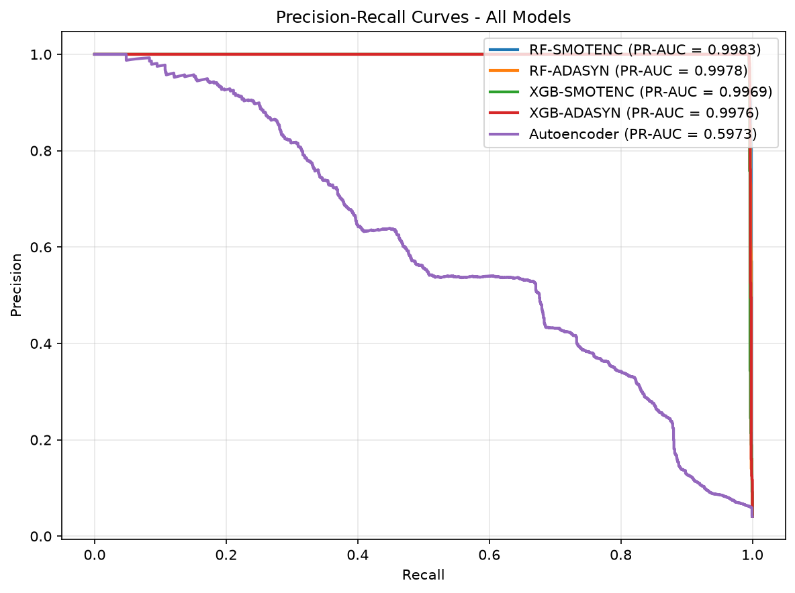

# BẢNG PHÂN CÔNG NHIỆM VỤ VÀ MỨC ĐỘ HOÀN THÀNH

Bảng phân công chi tiết vai trò, nhiệm vụ và tỷ lệ hoàn thành công việc của từng thành viên trong đồ án cuối kỳ:

| STT | Họ và Tên | MSSV | Vai trò | Nhiệm vụ chính phụ trách | Mức độ hoàn thành |
|:---:|---|:---:|:---:|---|:---:|
| 1 | Trần Hoàng Hôn | 26410046 | Trưởng nhóm | Quản lý tiến độ đồ án; điều phối chung các sprint; hỗ trợ slide thuyết trình PPT và hoàn thiện hồ sơ đóng gói bài nộp | 100% |
| 2 | Đặng Chí Thanh | 25730067 | Thành viên | Thiết kế kiến trúc hệ thống; Khám phá dữ liệu (EDA), Tiền xử lý dữ liệu và trích xuất 14 đặc trưng; Notebook 01 | 100% |
| 3 | Hoàng Cao Sơn | 25730061 | Thành viên | Phân tích và xử lý mất cân bằng lớp (SMOTENC, ADASYN); Nghiên cứu, huấn luyện và tối ưu mô hình Random Forest; Notebook 02 & 03 | 100% |
| 4 | Bùi Thị Mỷ Cẩm | 25730013 | Thành viên | Nghiên cứu, huấn luyện và tối ưu mô hình XGBoost; Xây dựng mạng nơ-ron Autoencoder phát hiện bất thường; Notebook 04 & 05 | 100% |
| 5 | Nguyễn Duy Khang | 26410055 | Thành viên | Xây dựng pipeline đánh giá và đối sánh hiệu năng chéo đa mô hình (ROC-AUC, PR-AUC, F1-Score); Xuất đồ thị đối chứng và bảng so sánh; Notebook 06 | 100% |
| 6 | Vũ Văn Duy | 26410031 | Thành viên | Biên soạn tài liệu Báo cáo học thuật chính thức (Chương 1–7); Tổng hợp cơ sở lý thuyết, phân tích kết quả thực nghiệm và tính toán khoảng tin cậy thống kê | 100% |
| 7 | Phạm Thành Trung | 26410141 | Thành viên | Thiết kế và phát triển ứng dụng Web tương tác Streamlit Demo; Tích hợp mô hình suy luận thời gian thực; Sản xuất video clip minh họa sản phẩm | 100% |

---

# TÓM TẮT

Gian lận trong giao dịch tài chính điện tử là bài toán phân loại nhị phân phức tạp do hiện tượng mất cân bằng lớp cực đoan và chi phí sai số không đối xứng. Báo cáo này xây dựng và đánh giá quy trình học máy phát hiện giao dịch bất thường trên bộ dữ liệu mô phỏng PaySim (6.362.620 bản ghi gốc). Quy trình lọc hai loại giao dịch `TRANSFER` và `CASH_OUT` chứa toàn bộ mẫu gian lận, giữ nguyên 8.213 giao dịch gian lận và lấy mẫu ngẫu nhiên lớp bình thường để thiết lập tập làm việc 200.000 bản ghi. Dữ liệu được chia phân tầng 80/20 độc lập trước khi chuẩn hóa nhằm tránh rò rỉ thông tin. Mười bốn đặc trưng được xây dựng thuộc ba nhóm: biến động số dư, hành vi dòng tiền và chu kỳ thời gian. Kỹ thuật tái lấy mẫu SMOTENC và ADASYN được áp dụng riêng trên tập huấn luyện.

Năm biến thể mô hình thuộc ba họ thuật toán (Random Forest, XGBoost và Autoencoder) được đánh giá trên cùng tập kiểm tra 40.000 giao dịch bằng Precision, Recall, F1-Score, ROC-AUC và Average Precision. Kết quả cho thấy Random Forest kết hợp SMOTENC đạt F1-Score cao nhất (0,9973), tiếp theo là XGBoost kết hợp SMOTENC (0,9963). Ngược lại, Autoencoder dạng không giám sát chỉ đạt F1-Score 0,5069 và Precision 0,3822 do tạo ra 1.998 cảnh báo nhầm, cho thấy việc nén biểu diễn không giám sát đơn giản khó phân tách ranh giới gian lận trên dữ liệu bảng.

Để kiểm tra độ nhạy của mô hình trước cảnh báo về rò rỉ dấu vết mô phỏng qua các cột số dư từ Kaggle, nhóm đã thực hiện nghiên cứu loại trừ đặc trưng (Ablation Study). Kết quả đối chứng cho thấy: khi loại bỏ hoàn toàn nhóm đặc trưng số dư, F1-Score của XGBoost giảm mạnh từ 0,9945 xuống 0,7116 và số ca bỏ sót gian lận tăng từ 8 lên 472 ca (gấp 59 lần). Điều này chứng minh hiệu năng cao của mô hình phụ thuộc chặt chẽ vào các đặc trưng chênh lệch số dư vốn là dấu vết của bộ mô phỏng PaySim. Mặt khác, việc cắt tỉa hai đặc trưng cờ nhị phân không đóng góp độ lợi (`is_night_transaction`, `is_large_transaction`) giúp mô hình XGBoost 12 đặc trưng tinh gọn hơn mà vẫn bảo toàn Recall 0,9951 và F1-Score 0,9948. Báo cáo cung cấp góc nhìn thực nghiệm khách quan về năng lực và giới hạn ngoại suy của mô hình học máy trên dữ liệu tài chính mô phỏng.

**Từ khóa:** phát hiện gian lận, PaySim, mất cân bằng lớp, SMOTENC, Random Forest, XGBoost, Autoencoder, Ablation Study.

---

# DANH MỤC TỪ VIẾT TẮT

| Ký hiệu / Viết tắt | Thuật ngữ tiếng Anh gốc | Diễn giải nghĩa tiếng Việt |
|:---:|---|---|
| **AI** | Artificial Intelligence | Trí tuệ Nhân tạo |
| **ML** | Machine Learning | Học máy |
| **EDA** | Exploratory Data Analysis | Phân tích và khám phá dữ liệu |
| **SMOTE** | Synthetic Minority Over-sampling Technique | Kỹ thuật tổng hợp mẫu thiểu số nhân tạo |
| **SMOTENC** | Synthetic Minority Over-sampling Technique for Nominal and Continuous | Kỹ thuật SMOTE kết hợp cho đặc trưng định danh và liên tục |
| **ADASYN** | Adaptive Synthetic Sampling | Kỹ thuật lấy mẫu thích nghi theo mật độ thiểu số khó học |
| **RF** | Random Forest | Thuật toán Rừng ngẫu nhiên |
| **XGB / XGBoost** | Extreme Gradient Boosting | Thuật toán Cây tăng cường độ dốc tối ưu |
| **AE** | Deep Autoencoder | Mạng nơ-ron sâu tự mã hóa |
| **ROC** | Receiver Operating Characteristic | Đường cong đặc trưng hoạt động của bộ thu |
| **ROC-AUC** | Area Under the Receiver Operating Characteristic Curve | Diện tích dưới đường cong ROC |
| **PR-AUC / AP** | Precision-Recall Area Under Curve / Average Precision | Độ chính xác trung bình dưới đường cong Precision–Recall |
| **TP / FP** | True Positive / False Positive | Đúng dương tính (bắt trúng gian lận) / Sai dương tính (báo động nhầm) |
| **TN / FN** | True Negative / False Negative | Đúng âm tính (giao dịch chuẩn) / Sai âm tính (bỏ sót gian lận) |
| **FPR / TPR** | False Positive Rate / True Positive Rate | Tỷ lệ cảnh báo nhầm / Tỷ lệ phát hiện gian lận (Recall) |
| **PaySim** | Financial Mobile Money Simulator | Bộ mô phỏng dữ liệu thanh toán tài chính di động |

---

# CHƯƠNG 1. GIỚI THIỆU

## 1.1. Bối cảnh

Sự phát triển nhanh chóng của các hệ thống thanh toán điện tử và dịch vụ tài chính di động kéo theo sự gia tăng đáng kể của các hành vi gian lận tài chính. Theo khảo sát tổng quan của Abdallah và cộng sự [1], phát hiện gian lận là một bài toán phức tạp do đặc thù dữ liệu quy mô lớn, phân bố lớp lệch nghiêm trọng và chi phí của các loại sai số không đồng đều. Một hệ thống phát hiện gian lận hiệu quả không chỉ cần nhận biết kịp thời các giao dịch bất thường mà còn phải duy trì tỷ lệ báo động giả ở mức thấp nhằm bảo vệ trải nghiệm của người dùng hợp lệ.

Trong bài toán phân loại giao dịch, mỗi giao dịch được mô tả bởi một tập đặc trưng như thời điểm, loại giao dịch, số tiền chuyển và biến động số dư. Hệ thống học máy nhận các đặc trưng này và dự đoán nhãn nhị phân: giao dịch hợp lệ hoặc giao dịch gian lận. Điểm mấu chốt của bài toán nằm ở chỗ số lượng giao dịch gian lận trong thực tế chỉ chiếm một tỷ lệ rất nhỏ (thường dưới 1%). Do đó, độ chính xác tổng thể (Accuracy) không còn là thước đo tin cậy, bởi một mô hình ngây thơ luôn dự đoán mọi giao dịch là bình thường vẫn có thể đạt Accuracy trên 99% nhưng hoàn toàn vô dụng trong việc ngăn chặn gian lận.

Một rào cản lớn khác trong nghiên cứu học thuật là dữ liệu giao dịch tài chính thực tế mang tính bảo mật và riêng tư cao, hiếm khi được các tổ chức tín dụng công bố rộng rãi. Công trình PaySim của Lopez-Rojas và cộng sự [2] được xây dựng nhằm tạo ra một tập dữ liệu mô phỏng dựa trên các tham số thống kê trích xuất từ nhật ký giao dịch thực tế của một dịch vụ tiền di động. Bộ dữ liệu PaySim công bố trên Kaggle [3] cung cấp môi trường thử nghiệm chuẩn mực cho bài toán, song kết quả nghiên cứu cần được đánh giá khách quan trong phạm vi dữ liệu mô phỏng.

## 1.2. Lý do chọn đề tài

Đề tài “Hệ thống phát hiện giao dịch tài chính bất thường và nghi vấn gian lận” bao hàm nhiều nội dung trọng tâm của môn Trí tuệ Nhân tạo:
1. **Kỹ thuật trích xuất đặc trưng (Feature Engineering):** Biến đổi các biến thô thành các chỉ số phản ánh sự sai lệch số dư và tính chu kỳ của hành vi giao dịch.
2. **Xử lý mất cân bằng lớp cực đoan (Imbalanced Learning):** Ứng dụng các thuật toán sinh mẫu tổng hợp như SMOTENC và ADASYN trên không gian đặc trưng hỗn hợp.
3. **So sánh đa dạng thuật toán:** Khảo sát và đối chiếu giữa các mô hình học có giám sát dựa trên tập hợp cây quyết định (Random Forest, XGBoost) và mô hình học không giám sát dựa trên mạng nơ-ron (Autoencoder).
4. **Đánh giá đa chiều trong điều kiện bất đối xứng:** Phân tích sự đánh đổi giữa hai loại sai số:
   - **False Negative (FN):** Bỏ sót gian lận, gây thiệt hại tài chính trực tiếp.
   - **False Positive (FP):** Cảnh báo nhầm, gây gián đoạn giao dịch hợp lệ và phát sinh chi phí xác minh thủ công.

Do đó, các chỉ số Precision, Recall, F1-Score, ROC-AUC và Average Precision được sử dụng làm hệ tiêu chuẩn đánh giá chính xuyên suốt đề tài.

## 1.3. Mục tiêu đề tài

### 1.3.1. Mục tiêu tổng quát

Xây dựng, thử nghiệm và đánh giá quy trình học máy phân loại giao dịch tài chính trên tập dữ liệu mô phỏng PaySim, đồng thời thực hiện thực nghiệm đối chứng loại trừ đặc trưng (Ablation Study) nhằm đánh giá khách quan vai trò của các nhóm đặc trưng đầu vào.

### 1.3.2. Mục tiêu cụ thể

1. Khảo sát cấu trúc dữ liệu PaySim, phân tích phân bố các loại giao dịch và tỷ lệ mất cân bằng lớp.
2. Thiết kế quy trình tiền xử lý dữ liệu: lọc hai loại giao dịch có gian lận, xây dựng các đặc trưng dẫn xuất, chuẩn hóa biến số và phân chia tập train/test chống rò rỉ.
3. Thử nghiệm kỹ thuật xử lý mất cân bằng SMOTENC và ADASYN trên tập huấn luyện.
4. Huấn luyện và đánh giá ba họ mô hình: Random Forest, XGBoost và Autoencoder.
5. Thực hiện thực nghiệm Ablation Study và Feature Pruning trên XGBoost để đo lường mức độ phụ thuộc vào nhóm đặc trưng số dư.
6. Đánh giá mô hình trên tập kiểm tra độc lập và quy chiếu xác suất về tỷ lệ gian lận gốc.
7. So sánh các mô hình, chỉ rõ các hạn chế phương pháp luận và định hướng cải tiến.
8. Xây dựng ứng dụng giao diện minh họa (Streamlit) cho phép nạp thông số giao dịch và trực quan hóa kết quả dự đoán.

## 1.4. Đối tượng và phạm vi nghiên cứu

- **Đối tượng nghiên cứu:** Các bản ghi giao dịch trong bộ dữ liệu mô phỏng PaySim.
- **Bài toán:** Phân loại nhị phân (`isFraud = 0` là giao dịch bình thường, `isFraud = 1` là giao dịch gian lận).
- **Phạm vi dữ liệu:** Lọc hai loại giao dịch `TRANSFER` và `CASH_OUT`, giữ toàn bộ 8.213 giao dịch gian lận và lấy mẫu ngẫu nhiên lớp bình thường để tạo tập làm việc 200.000 bản ghi.
- **Phạm vi thuật toán:** Random Forest, XGBoost và Deep Autoencoder (MLP). Kỹ thuật xử lý mất cân bằng: SMOTENC và ADASYN.
- **Phạm vi đánh giá:** Đánh giá trên tập kiểm tra 40.000 giao dịch (tỷ lệ fraud ~4,11%) và quy chiếu toán học về phân bố PaySim gốc (0,129%).
- **Ngoài phạm vi:** Đề tài không kết nối hệ thống ngân hàng thời gian thực và không khẳng định mô hình có thể áp dụng trực tiếp cho môi trường sản xuất nếu chưa qua kiểm chứng trên dữ liệu giao dịch thực tế. PaySim không cung cấp tọa độ địa lý nên đề tài không thể tính toán đặc trưng khoảng cách không gian.

## 1.5. Cấu trúc báo cáo

Báo cáo được bố cục thành 7 chương:
- Chương 1: Giới thiệu bối cảnh, mục tiêu và phạm vi nghiên cứu.
- Chương 2: Phát biểu bài toán và các thách thức kỹ thuật.
- Chương 3: Khám phá dữ liệu và kỹ thuật xây dựng đặc trưng.
- Chương 4: Phương pháp thực hiện, quy trình tiền xử lý và các mô hình học máy.
- Chương 5: Kết quả thực nghiệm và thực nghiệm đối chứng Ablation Study.
- Chương 6: Thảo luận kết quả, quy chiếu xác suất và phân tích hạn chế.
- Chương 7: Kết luận và hướng phát triển tiếp theo.
- Phần cuối gồm danh mục tài liệu tham khảo và phụ lục cấu trúc mã nguồn thực nghiệm.

---

# CHƯƠNG 2. PHÁT BIỂU BÀI TOÁN

## 2.1. Mô tả bài toán

Cho một tập dữ liệu các giao dịch tài chính, mỗi giao dịch được biểu diễn bằng một vector đặc trưng `x ∈ ℝ¹⁴`. Bài toán đặt ra là tìm hàm quyết định `f(x)` ánh xạ không gian đặc trưng vào tập nhãn nhị phân:
- `f(x) = 0`: Giao dịch bình thường (Normal).
- `f(x) = 1`: Giao dịch có dấu hiệu gian lận (Fraud).

Trong bài toán phát hiện gian lận tài chính, các trường dữ liệu thô thường chưa phản ánh trực tiếp được bản chất bất thường của giao dịch. Vì vậy, các đặc trưng sai lệch số dư được tính toán nhằm đo lường mức độ vi phạm nguyên tắc bảo toàn số tiền:
1. **Sai lệch số dư tài khoản nguồn:** Về mặt lý thuyết, số dư sau giao dịch phải bằng số dư trước trừ đi số tiền chuyển: `oldbalanceOrg - amount = newbalanceOrig`. Sai lệch được định nghĩa bằng: `errorBalanceOrig = oldbalanceOrg - amount - newbalanceOrig`.
2. **Sai lệch số dư tài khoản đích:** Số dư người nhận sau giao dịch phải bằng số dư trước cộng với số tiền nhận: `oldbalanceDest + amount = newbalanceDest`. Sai lệch được định nghĩa bằng: `errorBalanceDest = oldbalanceDest + amount - newbalanceDest`.
3. **Cờ rút cạn tài khoản (`is_drain_account`):** Nhận diện trường hợp tài khoản nguồn bị trừ hết số dư về 0 sau một giao dịch có giá trị lớn.

Sau bước tiền xử lý, mỗi mẫu giao dịch là một vector 14 chiều bao gồm 10 biến liên tục và 4 cờ nhị phân.

## 2.2. Đầu vào và đầu ra

### Đầu vào
Vector 14 đặc trưng sau khi tiền xử lý và chuẩn hóa:
- Thông tin thời gian: `step`, `hour_of_day`, cờ `is_night_transaction`.
- Thông tin số tiền: `amount`, tỷ lệ `amount_to_oldbalance_ratio`, cờ `is_large_transaction`.
- Thông tin số dư và sai lệch: `oldbalanceOrg`, `newbalanceOrig`, `oldbalanceDest`, `newbalanceDest`, `errorBalanceOrig`, `errorBalanceDest`.
- Cờ hành vi và loại giao dịch: `is_drain_account`, `type_TRANSFER`.

### Đầu ra
- Nhãn dự đoán nhị phân `ŷ ∈ {0, 1}`.
- Xác suất gian lận `P(y = 1|x)` đối với Random Forest và XGBoost, hoặc sai số tái tạo (Reconstruction Error) đối với Autoencoder.

## 2.3. Các thách thức chính

1. **Mất cân bằng lớp cực đoan:** Tỷ lệ gian lận trong dữ liệu PaySim gốc chỉ chiếm 0,129%. Việc học trên phân bố này dễ khiến các thuật toán phân loại bị thiên vị về lớp đa số.
2. **Bất đối xứng chi phí sai số:** Việc bỏ sót giao dịch gian lận (FN) thường dẫn tới tổn thất tài chính không thể thu hồi, trong khi cảnh báo nhầm (FP) gây phiền toái cho khách hàng. Hệ thống cần đạt sự cân bằng tối ưu giữa Precision và Recall.
3. **Nguy cơ rò rỉ dữ liệu (Data Leakage):** Việc tính toán tham số chuẩn hóa hoặc sinh mẫu tổng hợp nếu thực hiện trên toàn bộ tập dữ liệu trước khi chia sẽ làm sai lệch kết quả đánh giá trên tập kiểm tra.
4. **Dấu vết nhân tạo của dữ liệu mô phỏng (Simulator Artifacts):** Data card của PaySim [3] lưu ý rằng khi simulator hủy giao dịch gian lận bị phát hiện, các trường số dư có thể không được cập nhật bình thường, tạo ra các dấu vết nhân tạo giúp mô hình dễ dàng phát hiện nhưng không khái quát hóa được ngoài thực tế.

## 2.4. Yêu cầu kỹ thuật

Theo đề bài môn học:
- Sử dụng bộ dữ liệu công khai hoặc mô phỏng với quy mô tối thiểu 500 mẫu giao dịch.
- Tiền xử lý, chuẩn hóa các biến định lượng và mã hóa biến phân loại.
- Thử nghiệm tối thiểu hai thuật toán trong số Random Forest, XGBoost và Autoencoder.
- Áp dụng các kỹ thuật xử lý mất cân bằng như SMOTE, ADASYN hoặc trọng số lớp.
- Đánh giá bằng Precision, Recall, F1-Score, ROC-AUC; không dựa thuần túy vào Accuracy.
- Cung cấp mã nguồn thực thi, báo cáo học thuật và ứng dụng minh họa giao diện.

## 2.5. Câu hỏi nghiên cứu

1. Kỹ thuật tái lấy mẫu nào (SMOTENC hay ADASYN) mang lại hiệu quả cao hơn khi kết hợp với các mô hình cây quyết định trên dữ liệu có biến nhị phân?
2. Giữa mô hình học có giám sát (RF, XGBoost) và học không giám sát (Autoencoder), sự khác biệt về năng lực phát hiện và tỷ lệ báo động giả thể hiện như thế nào?
3. Mức độ phụ thuộc của mô hình vào các đặc trưng số dư lớn đến đâu, và liệu hiệu năng của mô hình có bị sụp đổ khi không có nhóm đặc trưng này?

---

# CHƯƠNG 3. MÔ TẢ DỮ LIỆU

## 3.1. Nguồn dữ liệu

Bộ dữ liệu PaySim [2], [3] mô phỏng hoạt động giao dịch tiền di động trong vòng một tháng (tương ứng 744 bước thời gian, mỗi bước là 1 giờ). Bộ dữ liệu có tổng cộng 6.362.620 dòng và 11 thuộc tính, không chứa giá trị thiếu (missing values).

## 3.2. Cấu trúc dữ liệu gốc

| Thuộc tính | Kiểu dữ liệu | Ý nghĩa nghiệp vụ |
|---|---|---|
| `step` | Số nguyên | Đơn vị thời gian (1 step = 1 giờ mô phỏng) |
| `type` | Chuỗi | Loại giao dịch (`CASH_IN`, `CASH_OUT`, `DEBIT`, `PAYMENT`, `TRANSFER`) |
| `amount` | Số thực | Số tiền giao dịch |
| `nameOrig` | Chuỗi | Định danh tài khoản khởi tạo giao dịch |
| `oldbalanceOrg` | Số thực | Số dư tài khoản nguồn trước giao dịch |
| `newbalanceOrig` | Số thực | Số dư tài khoản nguồn sau giao dịch |
| `nameDest` | Chuỗi | Định danh tài khoản thụ hưởng |
| `oldbalanceDest` | Số thực | Số dư tài khoản thụ hưởng trước giao dịch |
| `newbalanceDest` | Số thực | Số dư tài khoản thụ hưởng sau giao dịch |
| `isFraud` | Nhị phân | Nhãn mục tiêu (1 là gian lận, 0 là bình thường) |
| `isFlaggedFraud` | Nhị phân | Cờ cảnh báo nội bộ của simulator (chuyển trên 200.000 đơn vị tiền) |

## 3.3. Phân bố giao dịch và nhãn

Bảng 3.1 thống kê số lượng giao dịch theo từng loại và sự phân bổ của nhãn gian lận trong tập dữ liệu gốc:

**Bảng 3.1. Phân bố giao dịch theo loại và nhãn gian lận trong PaySim gốc**

| Loại giao dịch | Bình thường (Normal) | Gian lận (Fraud) | Tổng số | Tỷ lệ gian lận |
|---|---:|---:|---:|---:|
| `CASH_IN` | 1.399.284 | 0 | 1.399.284 | 0,00% |
| `CASH_OUT` | 2.233.384 | 4.116 | 2.237.500 | 0,18% |
| `DEBIT` | 41.432 | 0 | 41.432 | 0,00% |
| `PAYMENT` | 2.151.495 | 0 | 2.151.495 | 0,00% |
| `TRANSFER` | 528.812 | 4.097 | 532.909 | 0,77% |
| **Tổng** | **6.354.407** | **8.213** | **6.362.620** | **0,129%** |

Quan sát thấy toàn bộ 8.213 giao dịch gian lận chỉ xuất hiện ở hai loại hình `TRANSFER` và `CASH_OUT`. Do đó, quy trình tiền xử lý tiến hành lọc tập trung vào hai loại giao dịch này.

## 3.4. Downsampling và chia tập dữ liệu

Để giảm tải bộ nhớ và tối ưu thời gian huấn luyện mô hình, phương pháp downsampling có chủ đích được áp dụng: giữ lại toàn bộ 8.213 mẫu gian lận và lấy mẫu ngẫu nhiên 191.787 mẫu bình thường từ hai loại `TRANSFER` và `CASH_OUT`, thiết lập tập làm việc gồm đúng 200.000 giao dịch.

Dữ liệu sau đó được chia thành tập huấn luyện (80%, tương đương 160.000 mẫu) và tập kiểm tra (20%, tương đương 40.000 mẫu) bằng phương pháp phân tầng (Stratified Split) với `random_state = 42`.

**Bảng 3.2. Quy mô và tỷ lệ gian lận qua các giai đoạn phân chia dữ liệu**

| Tập dữ liệu | Bình thường | Gian lận | Tổng số | Tỷ lệ gian lận |
|---|---:|---:|---:|---:|
| PaySim gốc | 6.354.407 | 8.213 | 6.362.620 | 0,129082% |
| Sau downsampling | 191.787 | 8.213 | 200.000 | 4,106500% |
| Tập huấn luyện (Train 80%) | 153.430 | 6.570 | 160.000 | 4,106250% |
| Tập kiểm tra (Test 20%) | 38.357 | 1.643 | 40.000 | 4,107500% |

## 3.5. Các đặc trưng đầu vào

Hai cột định danh `nameOrig`, `nameDest` bị loại bỏ do số lượng giá trị phân biệt quá lớn và không mang tính khái quát hóa. Cột `isFlaggedFraud` bị loại do độ phủ rất thấp và phản ánh một quy tắc tĩnh đơn giản của simulator. 

Mười bốn đặc trưng cuối cùng được tổ chức thành ba nhóm chức năng:
1. **Nhóm 1 — Đặc trưng số dư và sai lệch (6 đặc trưng):** `oldbalanceOrg`, `newbalanceOrig`, `oldbalanceDest`, `newbalanceDest`, cùng hai biến sai lệch `errorBalanceOrig` và `errorBalanceDest`.
2. **Nhóm 2 — Đặc trưng quy mô và hành vi dòng tiền (4 đặc trưng):** Số tiền `amount`, tỷ lệ `amount_to_oldbalance_ratio = amount / (oldbalanceOrg + 10⁻⁵)`, cờ nhị phân `is_drain_account` (bằng 1 nếu `newbalanceOrig == 0` và `oldbalanceOrg > 0`), và biến nhị phân `type_TRANSFER`.
3. **Nhóm 3 — Đặc trưng chu kỳ thời gian (4 đặc trưng):** Bước thời gian `step`, giờ trong ngày `hour_of_day = step mod 24`, cờ nhị phân ban đêm `is_night_transaction` (giờ < 6), và cờ giao dịch lớn `is_large_transaction` (`amount > 200.000`).

Mười đặc trưng liên tục được chuẩn hóa bằng `StandardScaler` (chỉ khớp tham số trung bình và phương sai trên tập train), còn bốn cờ nhị phân được giữ nguyên giá trị 0/1.

## 3.6. Các hạn chế của tập dữ liệu

1. **Thay đổi tỷ lệ cơ sở (Prevalence Shift):** Việc downsampling làm tăng tỷ lệ gian lận từ 0,129% lên 4,107%. Điều này làm khuếch đại chỉ số Precision đo được trên tập test. Do đó, kết quả cần được quy chiếu lại về tỷ lệ gốc thông qua định lý Bayes tại Chương 6.
2. **Dấu vết rò rỉ của bộ mô phỏng:** Data card của PaySim [3] lưu ý các trường số dư có thể chứa tín hiệu nhân tạo do cơ chế mô phỏng cập nhật trạng thái khi phát hiện gian lận. Đây là lý do nhóm thiết kế thực nghiệm Ablation Study để kiểm tra tính độc lập của mô hình.
3. **Thiếu yếu tố địa lý và chuỗi thời gian liên tục:** Dữ liệu không cung cấp vị trí địa lý của thiết bị và không cho phép theo dõi lịch sử dài hạn của từng chủ tài khoản.

## 3.7. Kết luận chương

Bộ dữ liệu PaySim cung cấp mẫu số liệu phong phú về giao dịch tài chính di động. Quy trình chuẩn bị dữ liệu đã hoàn tất việc lọc, downsampling, xây dựng 14 đặc trưng và phân chia tập kiểm tra độc lập nhằm bảo đảm tính liêm chính thực nghiệm.

---

# CHƯƠNG 4. PHƯƠNG PHÁP THỰC HIỆN

## 4.1. Quy trình thực nghiệm tổng thể

Quy trình thực nghiệm gồm 6 bước tuần tự:
1. **Khám phá và làm sạch:** Kiểm tra kiểu dữ liệu, xác nhận không có giá trị khuyết thiếu.
2. **Lọc và lấy mẫu:** Lọc hai loại `TRANSFER` và `CASH_OUT`, downsample lớp bình thường để thu được tập dữ liệu 200.000 bản ghi.
3. **Phân chia dữ liệu:** Tách tập train (160.000) và tập test (40.000) theo phương pháp phân tầng.
4. **Xây dựng đặc trưng và chuẩn hóa:** Tính toán các biến sai lệch số dư, mã hóa `type_TRANSFER`, khớp `StandardScaler` trên tập train và biến đổi tập test.
5. **Xử lý mất cân bằng:** Áp dụng SMOTENC hoặc ADASYN riêng trên tập train.
6. **Huấn luyện và đánh giá:** Huấn luyện Random Forest, XGBoost, Autoencoder và đánh giá trên cùng tập test 40.000 mẫu độc lập.

## 4.2. Xử lý mất cân bằng: SMOTENC và ADASYN

Tập huấn luyện ban đầu có 153.430 mẫu bình thường và 6.570 mẫu gian lận (tỷ lệ 1:23,3). Nhóm khảo sát hai kỹ thuật tái lấy mẫu thiểu số:
- **SMOTENC [4]:** Mở rộng của thuật toán SMOTE, cho phép nội suy các biến liên tục đồng thời xác định giá trị cho các biến phân loại/nhị phân bằng phương pháp chọn giá trị phổ biến nhất (majority voting) giữa các láng giềng gần nhất. Điều này bảo đảm các cờ nhị phân như `is_drain_account` hay `type_TRANSFER` không bị biến dạng thành số thực liên tục.
- **ADASYN [5]:** Tạo mẫu tổng hợp dựa trên hàm phân bố mật độ, tập trung sinh mẫu nhiều hơn ở những vùng biên nơi các mẫu thiểu số khó phân loại. Do phiên bản hiện tại của ADASYN xử lý trên không gian liên tục, các cột nhị phân sau khi sinh được làm tròn về 0 hoặc 1.

Cả hai phương pháp đều được thiết lập với `sampling_strategy = 0.5` và `k_neighbors = 5`, đưa tỷ lệ gian lận trong tập huấn luyện lên khoảng 33,3% (1 gian lận : 2 bình thường). Tập kiểm tra 40.000 mẫu được giữ nguyên vẹn để bảo đảm tính khách quan.

## 4.3. Mô hình Random Forest

Random Forest [6] xây dựng một tập hợp nhiều cây quyết định độc lập thông qua kỹ thuật bagging (bootstrap aggregating) và chọn ngẫu nhiên tập con đặc trưng tại mỗi điểm tách. Mô hình giúp giảm phương sai và hạn chế quá khớp trên dữ liệu nhiều chiều.

Quá trình tinh chỉnh siêu tham số thực hiện bằng `RandomizedSearchCV` với 50 cấu hình và 5-fold cross-validation trên tập train. Cấu hình tối ưu thu được gồm:
- `n_estimators = 200` (đối với biến thể SMOTENC) và `500` (đối với ADASYN).
- `max_depth = 20`, `min_samples_split = 2`, `min_samples_leaf = 1`.
- `max_features = sqrt`, `class_weight = balanced_subsample`.

## 4.4. Mô hình XGBoost

XGBoost [7] là thuật toán tăng cường độ dốc (gradient boosting) trên cây quyết định, tối ưu hóa hàm mục tiêu có chứa thành phần chính quy hóa (L1 và L2) nhằm kiểm soát độ phức tạp của mô hình.

Quy trình sử dụng `XGBClassifier` với thuật toán cây xấp xỉ `tree_method = hist` và hàm mục tiêu `eval_metric = aucpr`. Do tập train đã qua oversampling, tham số `scale_pos_weight` được đặt bằng 1,0. Quá trình tìm kiếm siêu tham số qua `RandomizedSearchCV` xác lập cấu hình tối ưu:
- `n_estimators = 300`, `max_depth = 8`, `learning_rate = 0.2`.
- `subsample = 0.85`, `colsample_bytree = 1.0`, `min_child_weight = 3`, `gamma = 0.1`.

## 4.5. Mô hình Autoencoder theo hướng phát hiện bất thường

Autoencoder [8] là mạng nơ-ron học cách tái tạo lại vector đầu vào thông qua một lớp thắt cổ chai (bottleneck) có số chiều thấp hơn chiều đầu vào. Mô hình được xây dựng bằng `sklearn.neural_network.MLPRegressor` với cấu trúc đối xứng:
- Kiến trúc số nút qua các tầng: `14 → 16 → 8 → 4 → 8 → 16 → 14`.
- Tầng ẩn hẹp nhất (bottleneck) có kích thước 4 nút.
- Hàm kích hoạt: ReLU; thuật toán tối ưu: Adam; `learning_rate_init = 0.001`, `batch_size = 256`, `max_iter = 200`.

Mô hình chỉ được huấn luyện trên 122.744 mẫu bình thường trong tập train. Ý tưởng là mạng sẽ học cách tái tạo tốt các giao dịch hợp lệ. Đối với giao dịch gian lận, sai số bình phương trung bình (MSE) giữa vector đầu vào và vector tái tạo sẽ cao hơn bình thường và được sử dụng làm điểm bất thường (anomaly score). Ngưỡng phân loại được chọn tại phân vị 95 của sai số tái tạo trên tập validation (tương ứng giá trị ngưỡng 0,045456).

## 4.6. Thiết kế thực nghiệm Ablation Study và Cắt tỉa đặc trưng

Để đánh giá mức độ phụ thuộc của mô hình vào các đặc trưng số dư và kiểm tra cảnh báo rò rỉ của simulator, nhóm thiết kế thực nghiệm đối chứng trên thuật toán XGBoost với ba cấu hình đặc trưng:
1. **Full 14 (Baseline):** Sử dụng đầy đủ 14 đặc trưng.
2. **Pruned 12 (Optimized):** Loại bỏ hai cờ nhị phân `is_night_transaction` và `is_large_transaction` do mức đóng góp độ lợi thực tế bằng 0.
3. **No-Balance 6 (Ablation):** Loại bỏ toàn bộ 8 đặc trưng liên quan đến số dư và tỷ lệ số dư, chỉ giữ lại 6 đặc trưng thuần túy về giao dịch và thời gian: `step`, `amount`, `hour_of_day`, `type_TRANSFER`, `is_night_transaction`, `is_large_transaction`.

Cả ba cấu hình được huấn luyện với cùng tham số ngẫu nhiên, cùng cấu hình siêu tham số và đánh giá trên cùng tập kiểm tra 40.000 mẫu.

## 4.7. Kết luận chương

Hệ thống phương pháp luận được thiết kế chặt chẽ từ khâu chia dữ liệu, xử lý mất cân bằng, huấn luyện ba thuật toán đại diện cho cả hai trường phái có giám sát và không giám sát, cùng kịch bản kiểm chứng Ablation Study đối chứng độc lập.

---

# CHƯƠNG 5. KẾT QUẢ THỰC NGHIỆM

## 5.1. Phạm vi đánh giá

Tất cả năm biến thể mô hình được đánh giá trên cùng một tập kiểm tra độc lập gồm 40.000 giao dịch (38.357 mẫu bình thường và 1.643 mẫu gian lận). Các chỉ số được tính toán lại bằng script tự động hóa `run_report_metrics.py` gọi các hàm đánh giá chuẩn xác từ module `src/evaluation/`.

## 5.2. So sánh hiệu năng các mô hình

**Bảng 5.1. So sánh hiệu năng các mô hình trên tập kiểm tra (lớp gian lận)**

| Mô hình | Precision | Recall | F1-Score | ROC-AUC | Average Precision |
|---|---:|---:|---:|---:|---:|
| **Random Forest + SMOTENC** | **0,9994** | **0,9951** | **0,9973** | 0,9994 | **0,9983** |
| Random Forest + ADASYN | 0,9982 | 0,9951 | 0,9966 | 0,9992 | 0,9978 |
| XGBoost + SMOTENC | 0,9976 | 0,9951 | 0,9963 | 0,9993 | 0,9969 |
| XGBoost + ADASYN | 0,9957 | 0,9951 | 0,9954 | **0,9994** | 0,9976 |
| Autoencoder (MLP) | 0,3822 | 0,7523 | 0,5069 | 0,9318 | 0,5973 |

Random Forest kết hợp SMOTENC đạt F1-Score cao nhất (0,9973), với Precision đạt 0,9994 và Recall đạt 0,9951. Ba biến thể cây còn lại cũng đạt kết quả tiệm cận (F1 từ 0,9954 đến 0,9966).

Ngược lại, mô hình Autoencoder đạt kết quả tương đối thấp: F1-Score chỉ đạt 0,5069 và Precision dừng ở mức 0,3822 mặc dù ROC-AUC đạt 0,9318. Sự khác biệt giữa ROC-AUC (0,9318) và Average Precision (0,5973) phản ánh đặc thù của dữ liệu mất cân bằng: ROC-AUC sử dụng mẫu số là toàn bộ 38.357 mẫu bình thường nên gần 2.000 ca báo động giả chỉ làm giảm nhẹ chỉ số, trong khi Average Precision đo lường trực tiếp diện tích dưới đường Precision–Recall nên phản ánh trung thực sự sụt giảm độ chính xác.

## 5.3. Phân tích ma trận nhầm lẫn

Một phát hiện thực nghiệm quan trọng: **Cả bốn biến thể học có giám sát đều phát hiện đúng 1.635 trong tổng số 1.643 ca gian lận và cùng bỏ sót đúng 8 ca gian lận**. Việc đối chiếu vị trí các mẫu cho thấy phần giao của các tập mẫu bị bỏ sót là hoàn toàn trùng khớp giữa cả bốn mô hình. Ngay cả Autoencoder cũng bỏ sót 7 trong số 8 trường hợp này. Điều này chứng minh 8 mẫu gian lận này mang vector đặc trưng gần như không thể phân biệt được với các giao dịch bình thường trong không gian 14 chiều hiện tại.

Do đó, sự khác biệt giữa các mô hình học có giám sát chủ yếu nằm ở số lượng cảnh báo nhầm (FP):
- Random Forest + SMOTENC: 1 FP.
- Random Forest + ADASYN: 3 FP.
- XGBoost + SMOTENC: 4 FP.
- XGBoost + ADASYN: 7 FP.
- Autoencoder: 1.998 FP (bỏ sót 407 ca gian lận).

## 5.4. So sánh SMOTENC và ADASYN

Trên cả hai thuật toán Random Forest và XGBoost, kỹ thuật SMOTENC đều mang lại Precision và F1-Score nhỉnh hơn so với ADASYN. Nguyên nhân là SMOTENC duy trì được tính rời rạc của 4 cờ nhị phân qua cơ chế đa số, trong khi ADASYN sinh giá trị liên tục rồi làm tròn có thể tạo ra các điểm ngoại lai không phù hợp với phân bố thực tế.

## 5.5. Đánh giá mức độ quan trọng của đặc trưng

**Bảng 5.2. Năm đặc trưng có mức đóng góp cao nhất của Random Forest và XGBoost (dùng SMOTENC)**

| Hạng | Random Forest (Gini Importance) | Mức đóng góp | XGBoost (Gain Importance) | Mức đóng góp |
|:---:|---|---:|---|---:|
| 1 | `errorBalanceOrig` | 0,4110 | `errorBalanceOrig` | 0,4994 |
| 2 | `oldbalanceOrg` | 0,1606 | `newbalanceOrig` | 0,4717 |
| 3 | `is_drain_account` | 0,1090 | `errorBalanceDest` | 0,0098 |
| 4 | `newbalanceDest` | 0,0595 | `is_drain_account` | 0,0059 |
| 5 | `amount_to_oldbalance_ratio` | 0,0519 | `amount` | 0,0049 |

Cả hai mô hình đều xếp `errorBalanceOrig` ở vị trí quan trọng nhất. Tổng mức đóng góp của các biến số dư và sai lệch số dư chiếm tới 74,41% ở Random Forest và 98,54% ở XGBoost. Nếu tính thêm các đặc trưng phái sinh từ số dư (`is_drain_account`, `amount_to_oldbalance_ratio`), tỷ lệ này lần lượt là 90,50% và 99,30%. Các đặc trưng thời gian và loại giao dịch chỉ đóng góp một phần rất nhỏ còn lại.

## 5.6. Kết quả thực nghiệm Ablation Study và Cắt tỉa đặc trưng

Để kiểm tra trực tiếp mức độ phụ thuộc của mô hình vào các đặc trưng số dư, script `run_ablation_study.py` đã tiến hành huấn luyện và đánh giá ba cấu hình trên XGBoost.

**Bảng 5.3. Kết quả thực nghiệm Ablation Study và Cắt tỉa đặc trưng trên XGBoost**

| Cấu hình đặc trưng | Số ĐT | Precision | Recall | F1-Score | FN (bỏ sót) | FP (báo nhầm) | Thời gian suy luận | Precision quy chiếu gốc |
|---|:---:|---:|---:|---:|---:|---:|:---:|:---:|
| **Full 14 (Baseline)** | 14 | 0,9939 | 0,9951 | 0,9945 | 8 | 10 | 1,3 µs/mẫu | 83,15% (~261 FP/triệu GD) |
| **Pruned 12 (Optimized)** | 12 | **0,9945** | **0,9951** | **0,9948** | **8** | **9** | **1,5 µs/mẫu** | **84,57% (~235 FP/triệu GD)** |
| **No-Balance 6 (Ablation)** | 6 | 0,7106 | 0,7127 | 0,7116 | 472 | 477 | 1,4 µs/mẫu | 6,90% (~12.436 FP/triệu GD) |

Từ Bảng 5.3 và Hình 5.5, ba kết luận thực nghiệm được rút ra:
1. **Mô hình phụ thuộc sống còn vào nhóm đặc trưng số dư:** Khi loại bỏ toàn bộ các biến số dư (cấu hình No-Balance 6), F1-Score giảm sút nghiêm trọng từ 0,9945 xuống 0,7116. Số ca bỏ sót gian lận (FN) tăng vọt từ 8 lên 472 ca (tăng gấp 59 lần), và số cảnh báo nhầm (FP) tăng từ 10 lên 477 ca. Khi quy chiếu về tỷ lệ gian lận gốc, Precision chỉ còn 6,90%. Điều này xác nhận rằng: nếu không có thông tin biến động số dư, các đặc trưng giao dịch đơn thuần (`amount`, `step`, `hour`, `type`) không đủ sức mạnh phân tách để phát hiện gian lận trong tập PaySim.
2. **Xác nhận bản chất cảnh báo từ Kaggle:** Kết quả Ablation Study cung cấp bằng chứng thực nghiệm rõ ràng: chỉ số F1 tiệm cận 0,995 của mô hình có được chủ yếu nhờ khai thác dấu vết sai lệch số dư vốn là đặc trưng mô phỏng của PaySim. Điều này đòi hỏi sự cẩn trọng khi diễn giải kết quả sang môi trường thực tế.
3. **Hiệu quả của việc cắt tỉa đặc trưng (Feature Pruning):** Cấu hình Pruned 12 loại bỏ hai cờ nhị phân không mang lại độ lợi (`is_night_transaction`, `is_large_transaction`), giúp giảm 1 ca cảnh báo nhầm (FP giảm từ 10 xuống 9), F1-Score tăng nhẹ từ 0,9945 lên 0,9948 trong khi giảm bớt độ phức tạp tính toán. Thời gian suy luận của mô hình trên RAM đạt khoảng 1,5 µs/mẫu.

## 5.7. Kết luận chương

Chương 5 cung cấp các số liệu thực nghiệm nhất quán và có khả năng tái lập hoàn toàn. Bên cạnh việc khẳng định ưu thế của Random Forest và XGBoost kết hợp SMOTENC, thực nghiệm Ablation Study đã chỉ ra ranh giới năng lực thực tế của mô hình: sự vượt trội về chỉ số gắn liền chặt chẽ với dấu vết số dư trong bộ dữ liệu mô phỏng.

---

# CHƯƠNG 6. THẢO LUẬN

## 6.1. Trả lời các câu hỏi nghiên cứu

1. **Về kỹ thuật tái lấy mẫu:** SMOTENC phù hợp hơn ADASYN khi làm việc với không gian đặc trưng chứa các biến nhị phân, giúp mô hình duy trì số lượng cảnh báo nhầm thấp hơn trên cả Random Forest và XGBoost.
2. **Về sự đối lập giữa mô hình có giám sát và không giám sát:** Các mô hình cây có giám sát khai thác trực tiếp nhãn mục tiêu nên phân tách ranh giới rất chính xác trên tập kiểm tra. Ngược lại, Autoencoder hoạt động kém hiệu quả (Precision chỉ đạt 38,22% và tạo gần 2.000 cảnh báo nhầm), cho thấy phương pháp tái tạo MSE không giám sát gặp khó khăn lớn trên không gian đặc trưng dạng bảng không đồng nhất.
3. **Về mức độ phụ thuộc vào nhóm đặc trưng số dư:** Thực nghiệm Ablation Study đã chứng minh mô hình phụ thuộc gần như hoàn toàn vào các cột số dư. Khi loại bỏ nhóm này, khả năng nhận diện giảm sút nghiêm trọng (Recall giảm từ 99,51% xuống 71,27%).

## 6.2. Giải thích nguyên nhân các chỉ số đạt mức rất cao

F1-Score đạt trên 0,99 ở các mô hình học có giám sát bắt nguồn từ ba yếu tố chính:
1. **Tín hiệu phân tách mạnh từ biến `errorBalanceOrig`:** Trong PaySim, các giao dịch gian lận thường đi kèm với việc số dư nguồn bị trừ sai lệch so với số tiền chuyển. Đây là tín hiệu chỉ điểm cực kỳ rõ ràng mà các cây quyết định nhanh chóng nắm bắt ở các nút phân nhánh đầu tiên.
2. **Tác động khuếch đại của downsampling:** Tỷ lệ gian lận trong tập kiểm tra sau downsampling là 4,11% (cao hơn gấp 32 lần so với tỷ lệ gốc 0,129%). Precision đo được trên tập kiểm tra vì thế cao hơn nhiều so với khi chạy trên toàn bộ dữ liệu gốc.
3. **Phép chia phân tầng ngẫu nhiên:** Mặc dù đã chia train/test độc lập để chống rò rỉ tham số, việc chia ngẫu nhiên trên chuỗi thời gian làm cho các giao dịch trong cùng khung thời gian xuất hiện ở cả hai tập, tạo điều kiện thuận lợi hơn cho mô hình so với bài toán dự báo tương lai thực tế.

## 6.3. Hiệu năng quy chiếu về tỷ lệ gian lận gốc

Để đánh giá khách quan hiệu năng mô hình trong điều kiện thực tế, công thức quy chiếu Bayes được áp dụng để tính toán lại Precision trên tỷ lệ gốc 0,129082%, kết hợp với khoảng tin cậy 95% theo phương pháp Clopper–Pearson cho tỷ lệ báo động giả:

`Precision_calibrated = (TPR × π) / (TPR × π + FPR × (1 - π))`

với `π = 0,00129082` là tỷ lệ gian lận gốc.

**Bảng 6.1. Hiệu năng mô hình khi quy chiếu về tỷ lệ gian lận gốc của PaySim (0,129%)**

| Mô hình | FP trên test | Precision test | Precision quy chiếu | Khoảng tin cậy 95% | Báo nhầm ước tính / triệu GD |
|---|---:|---:|---:|:---:|---:|
| **Random Forest + SMOTENC** | 1 | 0,9994 | **0,9801** | 0,8985 – 0,9995 | 26 |
| Random Forest + ADASYN | 3 | 0,9982 | 0,9427 | 0,8491 – 0,9876 | 78 |
| XGBoost + SMOTENC | 4 | 0,9976 | 0,9250 | 0,8281 – 0,9784 | 104 |
| XGBoost + ADASYN | 7 | 0,9957 | 0,8757 | 0,7738 – 0,9460 | 182 |
| Autoencoder (MLP) | 1.998 | 0,3822 | 0,0183 | 0,0176 – 0,0191 | 52.022 |

Kết quả Bảng 6.1 cho thấy:
- Chênh lệch nhỏ về số ca FP trên tập kiểm tra trở nên rất rõ rệt khi đưa về phân bố gốc: khoảng cách giữa 1 ca FP (RF + SMOTENC) và 7 ca FP (XGBoost + ADASYN) làm Precision quy chiếu giảm từ 98,01% xuống 87,57%.
- Autoencoder có Precision quy chiếu sụt giảm còn 1,83%, đồng nghĩa với việc tạo ra hơn 52.000 cảnh báo nhầm trên mỗi triệu giao dịch, hoàn toàn không khả thi nếu vận hành độc lập.

## 6.4. Đánh giá độ tin cậy của việc xếp hạng mô hình

Khoảng tin cậy 95% ở Bảng 6.1 cho thấy sự chồng lấn đáng kể giữa các mô hình học có giám sát: khoảng của RF + SMOTENC (0,8985 – 0,9995) giao thoa với XGBoost + SMOTENC (0,8281 – 0,9784). Số ca báo động giả trên tập kiểm tra rất nhỏ (từ 1 đến 7 ca trên 38.357 mẫu), mang sai số thống kê tương đối lớn. Đồng thời, cả bốn mô hình đều bỏ sót cùng 8 ca gian lận. Vì vậy, kết luận chính xác là: **Các biến thể học có giám sát đạt hiệu năng tương đương nhau trên tập kiểm tra này**, và sự khác biệt nhỏ về thứ hạng có thể chỉ do dao động ngẫu nhiên của một lần phân chia dữ liệu.

## 6.5. Đánh giá hạn chế của mô hình Autoencoder

Mô hình Autoencoder thử nghiệm trong đồ án gặp phải những hạn chế cơ bản sau:
1. **Đặc thù dữ liệu bảng (Tabular Data):** Khác với ảnh hoặc âm thanh có cấu trúc không gian và tương quan cục bộ mạnh, dữ liệu bảng gồm các thuộc tính rời rạc và liên tục không đồng nhất, khiến hàm mất mát tái tạo MSE khó nắm bắt được ranh giới biểu diễn của lớp bình thường.
2. **Sự nhạy cảm của ngưỡng phân loại:** Ngưỡng sai số tái tạo 0,045456 (phân vị 95) được lựa chọn nhằm thỏa mãn điều kiện Recall tối thiểu, nhưng cái giá phải trả là chấp nhận 1.998 ca báo động giả. Nếu tăng ngưỡng để giảm báo động giả thì Recall lại sụt giảm nghiêm trọng.
3. **Kết luận:** Mô hình Autoencoder dạng MLP đơn giản không phù hợp để làm bộ phát hiện gian lận độc lập trên dữ liệu bảng PaySim so với các mô hình cây quyết định.

## 6.6. Hạn chế của nghiên cứu

1. **Giới hạn của dữ liệu mô phỏng PaySim:** Dữ liệu được sinh bằng quy tắc simulator nên không thể phản ánh đầy đủ các thủ đoạn gian lận tinh vi trong thực tế như lừa đảo phi kỹ thuật, chiếm quyền điều khiển tài khoản qua mã độc hay rửa tiền qua mạng lưới tài khoản rác.
2. **Phương pháp chia dữ liệu ngẫu nhiên:** Việc chia phân tầng ngẫu nhiên chưa đánh giá được hiện tượng trôi dạt khái niệm (Concept Drift) theo thời gian.
3. **Thiếu thông tin mạng lưới liên kết:** PaySim không cung cấp thông tin liên kết giữa các tài khoản để xây dựng các đặc trưng đồ thị (Graph Features).

## 6.7. Kết luận chương

Việc thảo luận và quy chiếu toán học đã làm sáng tỏ bản chất các con số thực nghiệm. Điểm số cao của các mô hình có giám sát phản ánh sự kết hợp giữa kỹ thuật trích xuất đặc trưng phù hợp và dấu vết của bộ mô phỏng PaySim, trong khi các giới hạn phương pháp luận được nhìn nhận trung thực và minh bạch.

---

# CHƯƠNG 7. KẾT LUẬN VÀ HƯỚNG PHÁT TRIỂN

## 7.1. Tóm tắt công việc đã thực hiện

Đồ án đã xây dựng và kiểm chứng một quy trình học máy hoàn chỉnh cho bài toán phát hiện giao dịch tài chính nghi vấn gian lận trên tập dữ liệu mô phỏng PaySim:
1. Lọc và lấy mẫu phân tầng 200.000 giao dịch từ hơn 6,36 triệu bản ghi gốc, bảo toàn toàn bộ mẫu gian lận.
2. Xây dựng 14 đặc trưng phản ánh sai lệch số dư, quy mô dòng tiền và chu kỳ thời gian.
3. Áp dụng kỹ thuật tái lấy mẫu SMOTENC và ADASYN trên tập huấn luyện độc lập.
4. Huấn luyện và đánh giá đối sánh năm biến thể mô hình thuộc ba họ: Random Forest, XGBoost và Deep Autoencoder.
5. Thực hiện thực nghiệm Ablation Study đối chứng, chứng minh định lượng mức độ phụ thuộc vào nhóm đặc trưng số dư và đề xuất cấu hình cắt tỉa 12 đặc trưng tinh gọn.
6. Xây dựng giao diện ứng dụng Streamlit cho phép người dùng nạp thông tin giao dịch và xem giải trình dự đoán theo thời gian thực.

## 7.2. Đối chiếu với mục tiêu đề ra

**Bảng 7.1. Mức độ hoàn thành các mục tiêu cụ thể của đồ án**

| STT | Mục tiêu cụ thể đề ra | Kết quả đạt được | Vị trí trình bày |
|:---:|---|:---:|---|
| 1 | Khảo sát và mô tả cấu trúc bộ dữ liệu PaySim | Hoàn thành | Chương 3 |
| 2 | Quy trình tiền xử lý và xây dựng đặc trưng dẫn xuất | Hoàn thành | Mục 2.1, 3.5, 4.1 |
| 3 | Khảo sát kỹ thuật SMOTENC và ADASYN trên tập train | Hoàn thành | Mục 4.2, 5.4 |
| 4 | Thử nghiệm ba họ thuật toán (RF, XGBoost, Autoencoder) | Hoàn thành | Mục 4.3, 4.4, 4.5, 5.2 |
| 5 | Thực nghiệm Ablation Study và Cắt tỉa đặc trưng | Hoàn thành | Mục 4.6, 5.6 |
| 6 | Đánh giá đa chỉ số và quy chiếu về phân bố gốc | Hoàn thành | Chương 5, Mục 6.3 |
| 7 | So sánh mô hình, phân tích hạn chế và hướng phát triển | Hoàn thành | Chương 5, 6, 7 |
| 8 | Xây dựng ứng dụng minh họa giao diện tương tác | Hoàn thành | Mã nguồn thư mục `demo/` |

Toàn bộ tám mục tiêu cụ thể đề ra ban đầu đều đã được hoàn thành đầy đủ, có mã nguồn kiểm chứng và số liệu tái lập.

## 7.3. Đóng góp của đồ án

1. **Xây dựng đường ống thực nghiệm chuẩn mực:** Quy trình xử lý dữ liệu, chuẩn hóa và tái lấy mẫu được thiết kế cách ly hoàn toàn tập kiểm tra, loại trừ rủi ro rò rỉ thông tin.
2. **Thực nghiệm đối chứng Ablation Study khách quan:** Thay vì chỉ công bố các chỉ số cao một cách thiếu phản biện, đồ án đã chứng minh định lượng sự sụt giảm hiệu năng khi tước bỏ nhóm đặc trưng số dư (F1 giảm từ 0,9945 xuống 0,7116), qua đó làm rõ tính hai mặt của việc sử dụng dữ liệu mô phỏng.
3. **Cắt tỉa đặc trưng hiệu quả:** Cấu hình 12 đặc trưng tinh gọn giúp loại bỏ hai cờ nhị phân nhiễu, giảm 1 ca cảnh báo nhầm và duy trì thời gian tính toán mô hình ở mức 1,5 µs/mẫu.
4. **Đánh giá thống kê cẩn trọng:** Đưa ra góc nhìn quy chiếu xác suất Bayes và khoảng tin cậy 95%, giúp phản ánh đúng bức tranh vận hành khi tỷ lệ gian lận trong thực tế ở mức rất thấp.

## 7.4. Hướng phát triển tiếp theo

1. **Mạng nơ-ron đồ thị (Graph Neural Networks - GNN):** Chuyển đổi bài toán từ phân loại từng dòng độc lập sang mô hình hóa đồ thị giao dịch liên kết giữa các tài khoản, giúp phát hiện các hành vi chuyển tiền lòng vòng hoặc mạng lưới rửa tiền tinh vi.
2. **Phân chia theo chuỗi thời gian (Time-series Split):** Đánh giá mô hình theo cơ chế chia thời gian trượt (rolling-window) nhằm kiểm tra khả năng thích ứng trước hiện tượng trôi dạt khái niệm (Concept Drift).
3. **Hiệu chuẩn xác suất (Probability Calibration):** Áp dụng Platt Scaling hoặc Isotonic Regression để chuẩn hóa đầu ra xác suất của mô hình, hỗ trợ việc thiết lập các ngưỡng cảnh báo linh hoạt theo từng ngưỡng rủi ro vận hành.

## 7.5. Kết luận chung

Đồ án môn học Trí tuệ Nhân tạo đã cung cấp một góc nhìn thực nghiệm toàn diện về bài toán phát hiện giao dịch tài chính bất thường. Qua việc kết hợp giữa kỹ thuật trích xuất đặc trưng, xử lý mất cân bằng lớp và so sánh các họ mô hình, nhóm không chỉ đạt được kết quả phân loại cao trên tập dữ liệu mô phỏng mà quan trọng hơn, đã chỉ rõ những thách thức nội tại về tính tổng quát hóa và ranh giới áp dụng của các mô hình học máy trong an toàn giao dịch điện tử.

---

# TÀI LIỆU THAM KHẢO

[1] A. Abdallah, M. A. Maarof, and A. Zainal, “Fraud detection system: A survey,” *Journal of Network and Computer Applications*, vol. 68, pp. 90–113, Nov. 2016, doi: https://doi.org/10.1016/j.jnca.2016.04.007. [Truy cập: 25/09/2026].

[2] E. A. Lopez-Rojas, A. Elmir, and S. Axelsson, “PaySim: A financial mobile money simulator for fraud detection,” in *Proc. 28th European Modeling and Simulation Symposium (EMSS)*, Larnaca, Cyprus, 2016, pp. 249–255. [Online]. Available: https://www.msc-les.org/proceedings/emss/2016/EMSS2016_249.pdf. [Truy cập: 25/09/2026].

[3] E. Lopez-Rojas, “Synthetic Financial Datasets for Fraud Detection,” *Kaggle*, 2017. [Online]. Available: https://www.kaggle.com/datasets/ealaxi/paysim1. [Truy cập: 25/09/2026].

[4] N. V. Chawla, K. W. Bowyer, L. O. Hall, and W. P. Kegelmeyer, “SMOTE: Synthetic Minority Over-sampling Technique,” *Journal of Artificial Intelligence Research*, vol. 16, pp. 321–357, Jun. 2002, doi: https://doi.org/10.1613/jair.953. [Truy cập: 25/09/2026].

[5] H. He, Y. Bai, E. A. Garcia, and S. Li, “ADASYN: Adaptive synthetic sampling approach for imbalanced learning,” in *Proc. IEEE International Joint Conference on Neural Networks (IJCNN)*, Hong Kong, 2008, pp. 1322–1328, doi: https://doi.org/10.1109/IJCNN.2008.4633969. [Truy cập: 25/09/2026].

[6] L. Breiman, “Random Forests,” *Machine Learning*, vol. 45, no. 1, pp. 5–32, Oct. 2001, doi: https://doi.org/10.1023/A:1010933404324. [Truy cập: 25/09/2026].

[7] T. Chen and C. Guestrin, “XGBoost: A scalable tree boosting system,” in *Proc. 22nd ACM SIGKDD International Conference on Knowledge Discovery and Data Mining (KDD)*, San Francisco, CA, USA, 2016, pp. 785–794, doi: https://doi.org/10.1145/2939672.2939785. [Truy cập: 25/09/2026].

[8] G. E. Hinton and R. R. Salakhutdinov, “Reducing the dimensionality of data with neural networks,” *Science*, vol. 313, no. 5786, pp. 504–507, Jul. 2006, doi: https://doi.org/10.1126/science.1127647. [Truy cập: 25/09/2026].

---

# PHỤ LỤC. CẤU TRÚC MÃ NGUỒN VÀ TÀI NGUYÊN THỰC NGHIỆM

Toàn bộ mã nguồn của đồ án được cấu trúc hóa theo dạng module hóa hướng tới tính tái lập thực nghiệm:

- `notebooks/01_eda.ipynb`: Phân tích khám phá dữ liệu, khảo sát các phân bố số tiền, thời gian và sự sai lệch số dư.
- `notebooks/02_imbalance_handling.ipynb`: Thử nghiệm các kỹ thuật tái lấy mẫu (SMOTENC, ADASYN) trên không gian dữ liệu hỗn hợp.
- `notebooks/03_model_random_forest.ipynb`: Huấn luyện, tìm kiếm siêu tham số và đánh giá mô hình Random Forest.
- `notebooks/04_model_xgboost.ipynb`: Huấn luyện, tối ưu Gradient Boosting và trích xuất mức độ quan trọng đặc trưng của XGBoost.
- `notebooks/05_model_autoencoder.ipynb`: Thiết kế mạng Autoencoder, huấn luyện không giám sát trên lớp bình thường và quét ngưỡng phát hiện bất thường.
- `notebooks/06_evaluation_comparison.ipynb`: Tổng hợp đối chứng các chỉ số thực nghiệm trên cùng tập kiểm tra độc lập.
- `src/preprocessing/`: Module làm sạch dữ liệu, xây dựng đặc trưng dẫn xuất và phân chia tập phân tầng chống rò rỉ.
- `src/models/`: Module định nghĩa các lớp huấn luyện và lưu trữ tham số mô hình.
- `src/evaluation/`: Module tính toán các chỉ số đánh giá và xuất đồ thị ROC, PR curves, Confusion Matrix.
- `scripts/run_ablation_study.py`: Kịch bản thực thi thực nghiệm kiểm chứng đối chứng loại trừ đặc trưng (Ablation Study) và Cắt tỉa (Feature Pruning).
- `run_report_metrics.py`: Kịch bản tự động tính toán lại toàn bộ chỉ số thực nghiệm và quy chiếu phân bố gian lận gốc.

